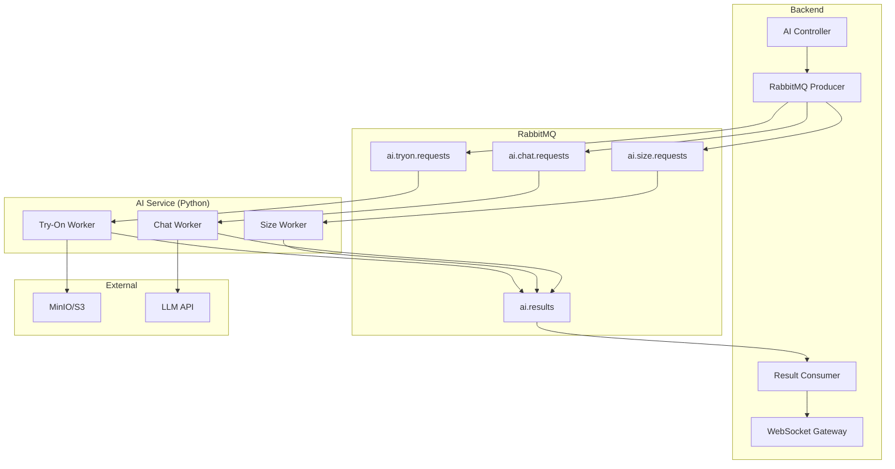
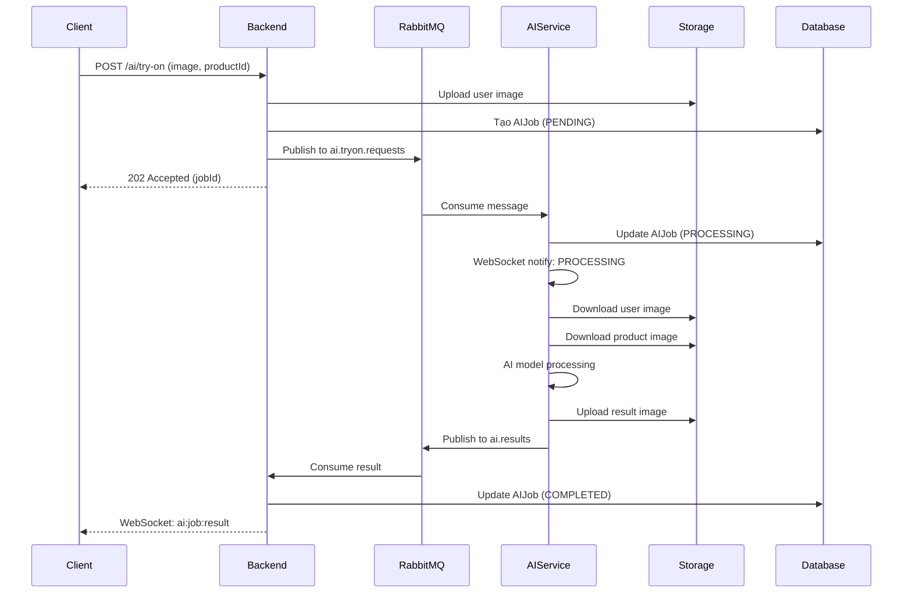
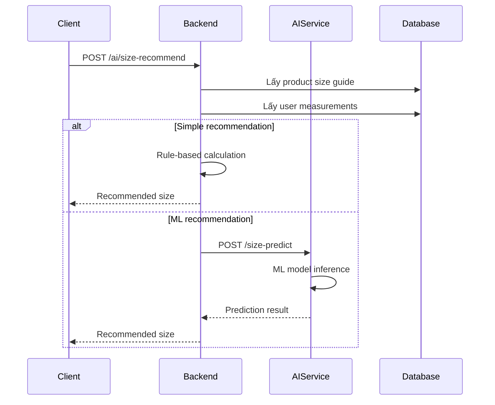
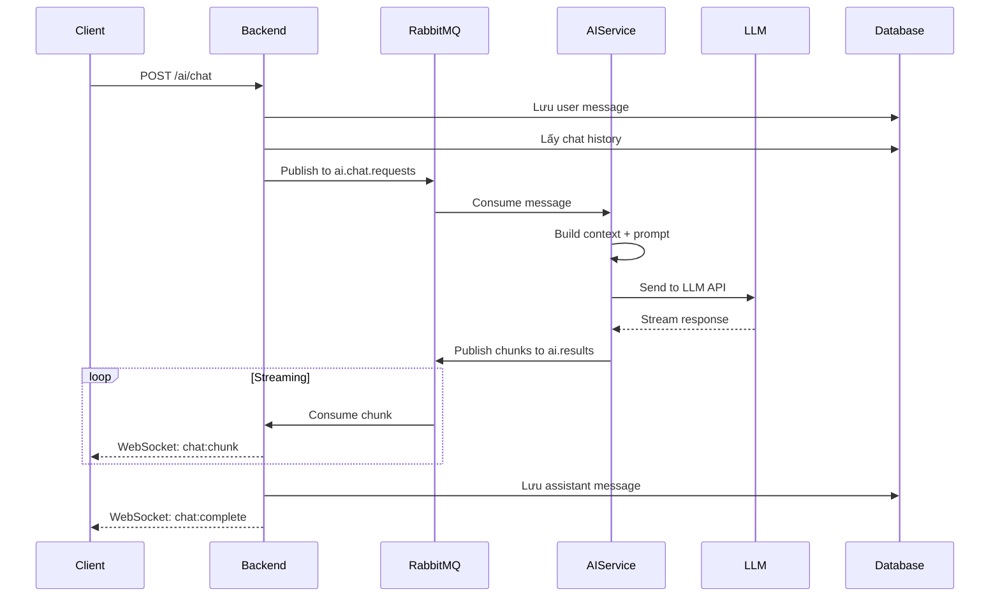
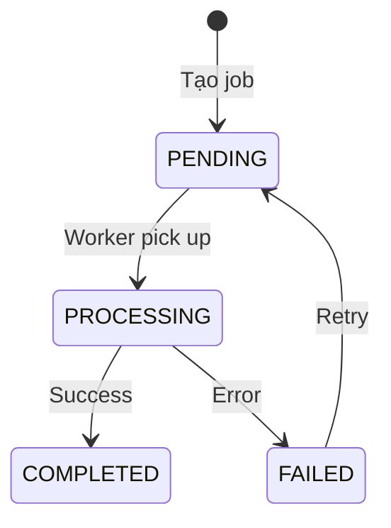

# Luồng Tính Năng AI - Ứng Dụng Web Bán Quần Áo AI

Tài liệu chi tiết các tính năng AI và luồng xử lý.

---

## Tổng Quan Tính Năng AI

| Tính năng           | Mô tả             | Xử lý                   |
| ------------------- | ----------------- | ----------------------- |
| Virtual Try-On      | Thử đồ ảo bằng AI | Bất đồng bộ (RabbitMQ)  |
| Size Recommendation | Gợi ý kích thước  | Đồng bộ / Bất đồng bộ   |
| AI Chat Support     | Hỗ trợ khách hàng | Streaming / Bất đồng bộ |

---

## Kiến Trúc AI Service



---

## 1. Virtual Try-On (Thử Đồ Ảo)

### Mô tả

Cho phép khách hàng upload ảnh của mình và xem "mặc thử" sản phẩm quần áo.

### Luồng Xử Lý Chi Tiết



### Request Format

```json
{
  "userImage": "<base64 hoặc file upload>",
  "productId": "clx...",
  "options": {
    "pose": "front",
    "quality": "high"
  }
}
```

### Message Queue Format

```json
{
  "jobId": "clx...",
  "userId": "clx...",
  "type": "VIRTUAL_TRYON",
  "data": {
    "userImageUrl": "https://storage/ai-inputs/abc.jpg",
    "productImageUrl": "https://storage/products/xyz.jpg",
    "productId": "clx...",
    "options": {
      "pose": "front",
      "quality": "high"
    }
  },
  "createdAt": "2026-01-29T15:00:00Z"
}
```

### AI Worker Implementation

```python
# workers/tryon_worker.py

class TryOnWorker:
    def __init__(self):
        self.model = load_viton_model()
        self.storage = StorageService()

    async def process(self, message: dict):
        job_id = message['jobId']

        try:
            # Download images
            user_image = await self.storage.download(message['data']['userImageUrl'])
            product_image = await self.storage.download(message['data']['productImageUrl'])

            # Preprocess
            user_image = self.preprocess_person(user_image)
            product_image = self.preprocess_garment(product_image)

            # Run model
            result_image = self.model.inference(user_image, product_image)

            # Upload result
            result_url = await self.storage.upload(
                result_image,
                f"ai-results/{job_id}.jpg"
            )

            # Publish result
            await self.publish_result({
                'jobId': job_id,
                'status': 'COMPLETED',
                'resultUrl': result_url
            })

        except Exception as e:
            await self.publish_result({
                'jobId': job_id,
                'status': 'FAILED',
                'errorMessage': str(e)
            })
```

### Kết Quả

```json
{
  "jobId": "clx...",
  "status": "COMPLETED",
  "resultUrl": "https://storage/ai-results/abc123.jpg",
  "processingTime": 15.5,
  "metadata": {
    "confidence": 0.95,
    "modelVersion": "viton-hd-v2"
  }
}
```

---

## 2. Size Recommendation (Gợi Ý Kích Thước)

### Mô tả

Dựa trên số đo cơ thể của khách hàng và bảng size sản phẩm, đề xuất size phù hợp nhất.

### Luồng Xử Lý



### Request Format

```json
{
  "productId": "clx...",
  "measurements": {
    "height": 170,
    "weight": 65,
    "chest": 95,
    "waist": 80,
    "hips": 98
  }
}
```

### Algorithm (Rule-based)

```python
# services/size_service.py

class SizeRecommendationService:
    def recommend(self, measurements: dict, size_guide: dict) -> dict:
        scores = {}

        for size, specs in size_guide.items():
            score = 0
            factors = 0

            # Chest comparison
            if 'chest' in specs and 'chest' in measurements:
                chest_range = self.parse_range(specs['chest'])
                chest = measurements['chest']
                score += self.range_score(chest, chest_range)
                factors += 1

            # Waist comparison
            if 'waist' in specs and 'waist' in measurements:
                waist_range = self.parse_range(specs['waist'])
                waist = measurements['waist']
                score += self.range_score(waist, waist_range)
                factors += 1

            # ... more measurements

            scores[size] = score / factors if factors > 0 else 0

        # Sort by score
        sorted_sizes = sorted(scores.items(), key=lambda x: x[1], reverse=True)

        return {
            'recommendedSize': sorted_sizes[0][0],
            'confidence': sorted_sizes[0][1],
            'alternatives': [
                {'size': s, 'confidence': c}
                for s, c in sorted_sizes[1:3]
            ]
        }

    def range_score(self, value: float, range_tuple: tuple) -> float:
        min_val, max_val = range_tuple
        mid = (min_val + max_val) / 2

        if min_val <= value <= max_val:
            # Perfect fit: higher score for closer to mid
            return 1.0 - abs(value - mid) / (max_val - min_val)
        else:
            # Out of range: negative score
            if value < min_val:
                return -abs(value - min_val) / 10
            else:
                return -abs(value - max_val) / 10
```

### Response Format

```json
{
  "recommendedSize": "M",
  "confidence": 0.92,
  "alternatives": [
    {
      "size": "L",
      "confidence": 0.78,
      "note": "Nếu bạn thích mặc rộng"
    },
    {
      "size": "S",
      "confidence": 0.65,
      "note": "Nếu bạn thích mặc ôm"
    }
  ],
  "tips": [
    "Với chiều cao 170cm, size M sẽ vừa vặn nhất",
    "Vòng ngực 95cm phù hợp với bảng size M (94-98cm)",
    "Nếu bạn có vòng eo lớn hơn, có thể cân nhắc size L"
  ],
  "fitAnalysis": {
    "chest": { "fit": "good", "note": "Vừa vặn" },
    "waist": { "fit": "perfect", "note": "Hoàn hảo" },
    "length": { "fit": "good", "note": "Phù hợp chiều cao" }
  }
}
```

---

## 3. AI Chat Support (Hỗ Trợ Chat AI)

### Mô tả

Chatbot AI hỗ trợ khách hàng tư vấn sản phẩm, giải đáp thắc mắc.

### Luồng Xử Lý



### System Prompt

```python
SYSTEM_PROMPT = """
Bạn là trợ lý AI của cửa hàng thời trang ABC Fashion.

Nhiệm vụ của bạn:
1. Tư vấn sản phẩm phù hợp với khách hàng
2. Giải đáp thắc mắc về size, chất liệu, cách phối đồ
3. Hỗ trợ khách hàng trong quá trình mua sắm
4. Cung cấp thông tin về chính sách đổi trả, vận chuyển

Nguyên tắc:
- Luôn thân thiện, lịch sự
- Trả lời bằng tiếng Việt
- Đưa ra gợi ý cụ thể khi có thể
- Không tự ý giảm giá hoặc cam kết ngoài chính sách

Thông tin cửa hàng:
- Địa chỉ: 123 Nguyễn Huệ, Q1, TP.HCM
- Hotline: 1900 1234
- Đổi trả trong 7 ngày với sản phẩm còn nguyên tem
- Freeship đơn từ 500k
"""
```

### Context Building

```python
# workers/chat_worker.py

class ChatWorker:
    def build_context(self, session_id: str, user_message: str) -> list:
        # Get chat history
        history = self.db.get_chat_history(session_id, limit=10)

        # Get user profile if available
        user = self.db.get_user_by_session(session_id)

        # Get relevant products if mentioned
        products = self.search_products(user_message)

        messages = [
            {"role": "system", "content": SYSTEM_PROMPT}
        ]

        # Add user context
        if user:
            messages.append({
                "role": "system",
                "content": f"Khách hàng: {user.name}, đã mua {user.order_count} đơn"
            })

        # Add product context if relevant
        if products:
            product_info = "\n".join([
                f"- {p.name}: {p.price}đ, còn size {p.available_sizes}"
                for p in products[:3]
            ])
            messages.append({
                "role": "system",
                "content": f"Sản phẩm liên quan:\n{product_info}"
            })

        # Add chat history
        for msg in history:
            messages.append({
                "role": msg.role.lower(),
                "content": msg.content
            })

        # Add current message
        messages.append({
            "role": "user",
            "content": user_message
        })

        return messages
```

### Response với Product Suggestions

```json
{
  "sessionId": "clx...",
  "message": {
    "id": "clx...",
    "role": "ASSISTANT",
    "content": "Chào bạn! Tôi thấy bạn quan tâm đến áo thun cho mùa hè. Dựa trên xu hướng hiện tại, tôi gợi ý một số mẫu sau:\n\n1. **Áo Thun Nam Basic** - 249,000đ (đang sale từ 299,000đ)\n2. **Áo Polo Cotton** - 399,000đ\n\nBạn có thể cho tôi biết thêm về phong cách và ngân sách để tôi tư vấn chính xác hơn không?",
    "metadata": {
      "suggestedProducts": ["clx_product_1", "clx_product_2"],
      "intent": "product_inquiry",
      "confidence": 0.89
    }
  }
}
```

---

## AI Job Status & Tracking

### Job States



### WebSocket Events

```typescript
// Client-side
socket.on("ai:job:status", (data) => {
  // { jobId, status, progress }
  updateJobProgress(data);
});

socket.on("ai:job:result", (data) => {
  // { jobId, status, resultUrl, metadata }
  displayResult(data);
});

socket.on("chat:chunk", (data) => {
  // { sessionId, content }
  appendToChat(data);
});

socket.on("chat:complete", (data) => {
  // { sessionId, messageId, metadata }
  finalizeMessage(data);
});
```

---

## Rate Limiting

### Giới hạn theo endpoint

| Endpoint                | Limit | Window |
| ----------------------- | ----- | ------ |
| POST /ai/try-on         | 5     | 1 phút |
| POST /ai/size-recommend | 20    | 1 phút |
| POST /ai/chat           | 30    | 1 phút |

### Implementation

```typescript
// Backend rate limiter
@Throttle(5, 60)
@Post('try-on')
async tryOn(@Body() dto: TryOnDto) {
  // ...
}
```

---

## Error Handling

### Retry Strategy

```python
# AI Service retry configuration
MAX_RETRIES = 3
RETRY_DELAYS = [5, 30, 120]  # seconds

async def process_with_retry(job: dict):
    for attempt in range(MAX_RETRIES):
        try:
            return await process_job(job)
        except TransientError as e:
            if attempt < MAX_RETRIES - 1:
                await asyncio.sleep(RETRY_DELAYS[attempt])
            else:
                raise
```

### Error Types

| Error        | Action                |
| ------------ | --------------------- |
| InvalidImage | Notify user, no retry |
| ModelTimeout | Retry 3 times         |
| StorageError | Retry 3 times         |
| LLMRateLimit | Retry with backoff    |
