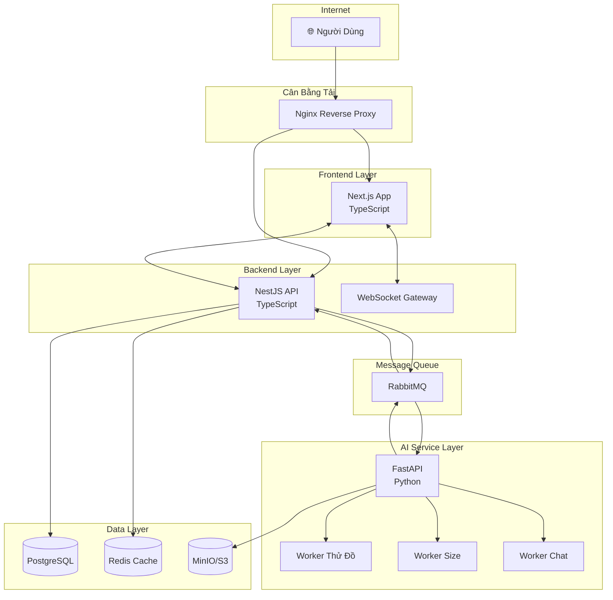
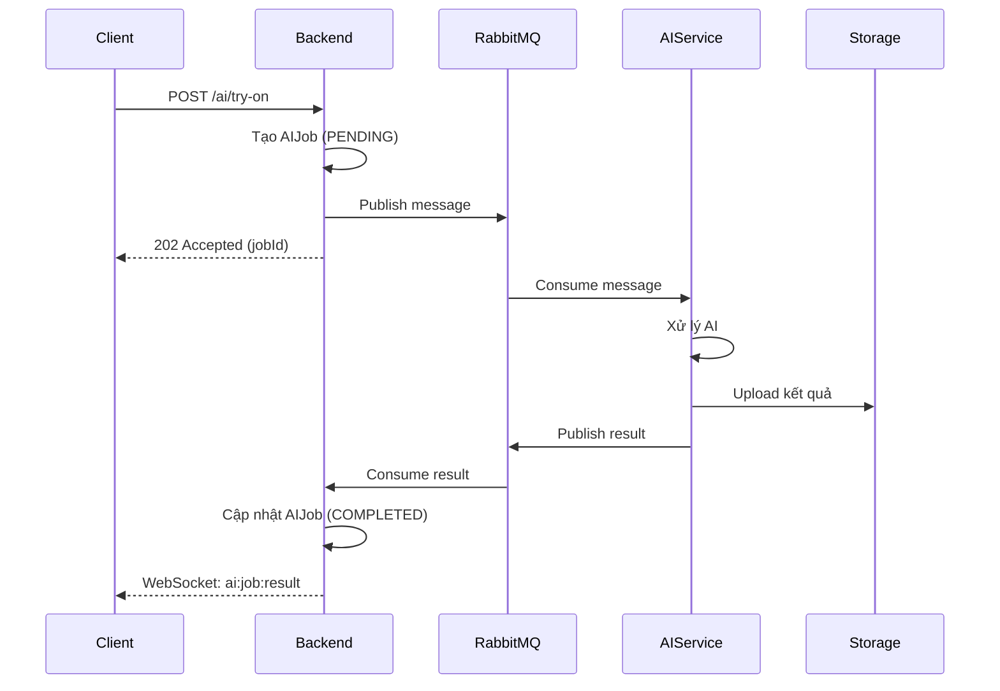
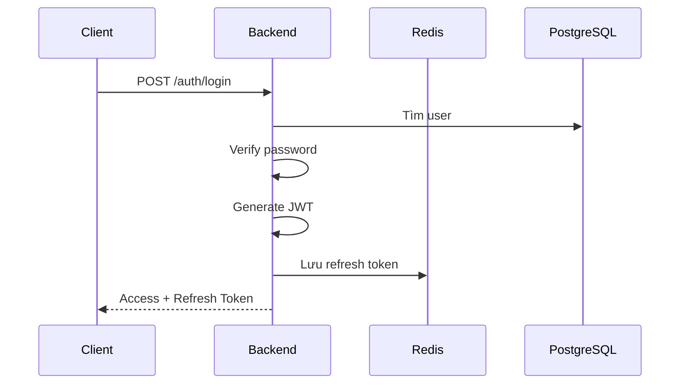
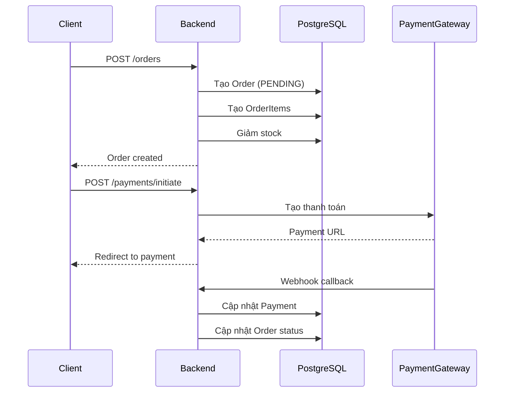
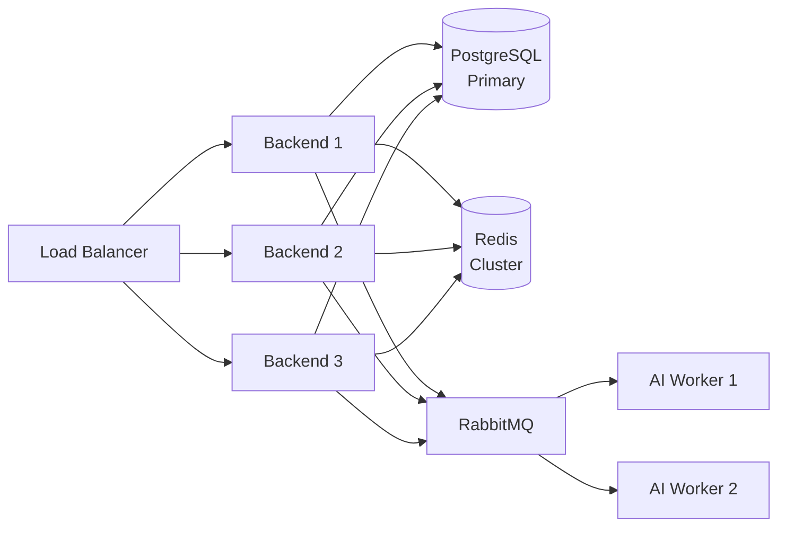

# Kiến Trúc Hệ Thống - Ứng Dụng Web Bán Quần Áo AI

## Tổng Quan

Hệ thống thương mại điện tử bán quần áo tích hợp AI với kiến trúc microservices.

---

## Sơ Đồ Kiến Trúc Tổng Thể



---

## Các Thành Phần

### 1. Frontend (Next.js)

**Công nghệ:**

- Next.js 14+ (App Router)
- TypeScript
- TailwindCSS
- Zustand (State Management)
- Socket.io Client

**Chức năng:**

- Server-Side Rendering (SEO)
- Client-side navigation
- Real-time updates via WebSocket
- Responsive design

---

### 2. Backend (NestJS)

**Công nghệ:**

- NestJS Framework
- TypeScript
- Prisma ORM
- Passport.js (Auth)
- Socket.io Server

**Modules:**
| Module | Chức năng |
|--------|-----------|
| Auth | JWT authentication, refresh token |
| Users | Quản lý người dùng, hồ sơ |
| Products | CRUD sản phẩm, tìm kiếm |
| Cart | Giỏ hàng (Redis-backed) |
| Orders | Quản lý đơn hàng, state machine |
| Payments | Tích hợp MoMo, ZaloPay, Bank |
| AI | Điều phối tác vụ AI |
| WebSocket | Real-time notifications |
| Queue | RabbitMQ producer/consumer |

---

### 3. AI Service (FastAPI)

**Công nghệ:**

- Python 3.11+
- FastAPI
- Pika (RabbitMQ)
- Boto3 (S3)
- PyTorch / TensorFlow

**Workers:**
| Worker | Chức năng |
|--------|-----------|
| tryon_worker | Thử đồ ảo với AI |
| size_worker | Gợi ý kích thước |
| chat_worker | Hỗ trợ khách hàng (LLM) |

---

### 4. Message Queue (RabbitMQ)

**Queues:**

```
ai.tryon.requests    → Yêu cầu thử đồ
ai.size.requests     → Yêu cầu gợi ý size
ai.chat.requests     → Tin nhắn chat
ai.results           → Kết quả AI → Backend
```

**Flow:**



---

### 5. Database (PostgreSQL)

**Cấu hình:**

- PostgreSQL 15+
- Connection pooling (PgBouncer)
- Backup hàng ngày

**Schema Groups:**

- Users & Auth
- Products & Categories
- Orders & Payments
- AI Jobs & Chat

---

### 6. Cache (Redis)

**Mục đích:**
| Key Pattern | Mô tả | TTL |
|-------------|-------|-----|
| `session:*` | User sessions | 24h |
| `cart:*` | Giỏ hàng guest | 7d |
| `product:*` | Cache sản phẩm | 1h |
| `rate:*` | Rate limiting | 1m |
| `ai:job:*` | Trạng thái AI job | 1h |

---

### 7. Object Storage (MinIO/S3)

**Buckets:**
| Bucket | Nội dung |
|--------|----------|
| `products` | Ảnh sản phẩm |
| `avatars` | Ảnh đại diện user |
| `ai-inputs` | Ảnh upload cho AI |
| `ai-results` | Kết quả AI (try-on) |

---

## Luồng Dữ Liệu Chính

### Luồng Đăng Nhập



### Luồng Đặt Hàng



---

## Bảo Mật

### Authentication

- JWT Access Token (15 phút)
- Refresh Token (7 ngày, rotate on use)
- Bcrypt password hashing

### Authorization

- Role-based: USER, ADMIN
- Guard-level protection
- Resource ownership validation

### API Security

- HTTPS only
- CORS configuration
- Rate limiting (Redis)
- Input validation (class-validator)
- SQL injection prevention (Prisma)

### Payment Security

- HMAC signature verification
- Idempotency keys
- Webhook IP whitelist
- Sensitive data encryption

---

## Scalability

### Horizontal Scaling



### Caching Strategy

- **L1:** In-memory (NestJS Cache)
- **L2:** Redis (shared)
- **L3:** CDN (static assets)

---

## Monitoring & Logging

### Logging

- Winston (Backend)
- Structured JSON logs
- Log levels: error, warn, info, debug

### Metrics

- Prometheus + Grafana
- API response times
- Queue depths
- Error rates

### Health Checks

- `/health` endpoint
- Database connectivity
- Redis connectivity
- RabbitMQ connectivity

---

## Deployment

### Docker Containers

| Service    | Port        | Replicas      |
| ---------- | ----------- | ------------- |
| frontend   | 3000        | 2+            |
| backend    | 3001        | 2+            |
| ai-service | 8000        | 2+            |
| postgres   | 5432        | 1 (+ replica) |
| redis      | 6379        | 1 (+ replica) |
| rabbitmq   | 5672, 15672 | 1             |
| minio      | 9000, 9001  | 1             |
| nginx      | 80, 443     | 1             |

### Environments

- **Development:** Docker Compose local
- **Staging:** Docker Compose on VPS
- **Production:** Kubernetes / Docker Swarm
