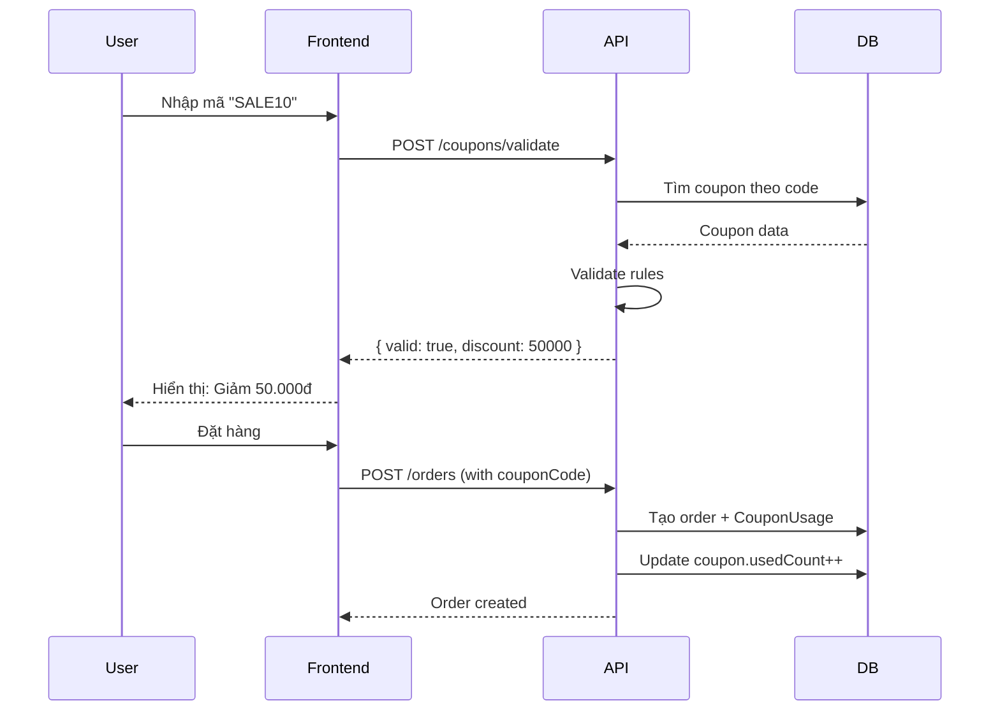

# Mã Giảm Giá (Coupons) - Tài Liệu Thiết Kế

Tài liệu mô tả tính năng mã giảm giá cho hệ thống Fashion AI E-commerce.

---

## 1. Tổng Quan

### 1.1. Mục Tiêu

- Cho phép Admin tạo và quản lý mã giảm giá
- Khách hàng có thể áp dụng mã khi thanh toán
- Hỗ trợ nhiều loại giảm giá: cố định, phần trăm, miễn phí giao hàng

### 1.2. Các Loại Mã Giảm Giá

| Loại              | Mô tả                | Ví dụ        |
| ----------------- | -------------------- | ------------ |
| **PERCENTAGE**    | Giảm theo %          | Giảm 10%     |
| **FIXED_AMOUNT**  | Giảm số tiền cố định | Giảm 50.000đ |
| **FREE_SHIPPING** | Miễn phí vận chuyển  | Miễn ship    |

---

## 2. Database Schema

### 2.1. Model Coupon

```prisma
model Coupon {
    id              String       @id @default(cuid())
    code            String       @unique          // Mã coupon (VD: SALE10)
    name            String                        // Tên hiển thị
    description     String?                       // Mô tả
    type            CouponType                    // Loại giảm giá
    value           Decimal      @db.Decimal(12, 2) // Giá trị giảm

    // Điều kiện áp dụng
    minOrderValue   Decimal?     @db.Decimal(12, 2) @map("min_order_value")
    maxDiscount     Decimal?     @db.Decimal(12, 2) @map("max_discount")

    // Giới hạn sử dụng
    usageLimit      Int?         @map("usage_limit")      // Tổng số lần dùng tối đa
    usagePerUser    Int          @default(1) @map("usage_per_user") // Số lần/user
    usedCount       Int          @default(0) @map("used_count")     // Đã sử dụng

    // Thời gian hiệu lực
    startDate       DateTime     @map("start_date")
    endDate         DateTime     @map("end_date")

    // Trạng thái
    isActive        Boolean      @default(true) @map("is_active")

    // Timestamps
    createdAt       DateTime     @default(now()) @map("created_at")
    updatedAt       DateTime     @updatedAt @map("updated_at")

    // Relations
    usages          CouponUsage[]
    orders          Order[]

    @@map("coupons")
}

enum CouponType {
    PERCENTAGE        // Giảm theo phần trăm
    FIXED_AMOUNT      // Giảm số tiền cố định
    FREE_SHIPPING     // Miễn phí vận chuyển
}

model CouponUsage {
    id        String   @id @default(cuid())
    couponId  String   @map("coupon_id")
    userId    String   @map("user_id")
    orderId   String?  @map("order_id")
    usedAt    DateTime @default(now()) @map("used_at")

    coupon    Coupon   @relation(fields: [couponId], references: [id])

    @@unique([couponId, userId, orderId])
    @@map("coupon_usages")
}
```

---

## 3. API Endpoints

### 3.1. Public APIs (User)

| Method | Endpoint            | Mô tả                   |
| ------ | ------------------- | ----------------------- |
| POST   | `/coupons/validate` | Kiểm tra mã hợp lệ      |
| POST   | `/coupons/apply`    | Áp dụng mã vào giỏ hàng |
| DELETE | `/coupons/remove`   | Bỏ mã khỏi giỏ hàng     |

### 3.2. Admin APIs

| Method | Endpoint                   | Mô tả               |
| ------ | -------------------------- | ------------------- |
| GET    | `/admin/coupons`           | Danh sách tất cả mã |
| GET    | `/admin/coupons/:id`       | Chi tiết 1 mã       |
| POST   | `/admin/coupons`           | Tạo mã mới          |
| PUT    | `/admin/coupons/:id`       | Cập nhật mã         |
| DELETE | `/admin/coupons/:id`       | Xóa mã              |
| GET    | `/admin/coupons/:id/usage` | Lịch sử sử dụng     |

---

## 4. API Request/Response

### 4.1. Validate Coupon

```http
POST /api/coupons/validate
Content-Type: application/json
Authorization: Bearer <token>

{
    "code": "SALE10",
    "orderTotal": 500000
}
```

**Response (Success):**

```json
{
  "valid": true,
  "coupon": {
    "code": "SALE10",
    "name": "Giảm 10%",
    "type": "PERCENTAGE",
    "value": 10,
    "discountAmount": 50000,
    "finalTotal": 450000
  }
}
```

**Response (Error):**

```json
{
  "valid": false,
  "error": "Mã giảm giá đã hết hạn",
  "errorCode": "COUPON_EXPIRED"
}
```

### 4.2. Create Coupon (Admin)

```http
POST /api/admin/coupons
Content-Type: application/json
Authorization: Bearer <admin_token>

{
    "code": "SUMMER2026",
    "name": "Summer Sale 2026",
    "description": "Giảm giá hè 2026",
    "type": "PERCENTAGE",
    "value": 15,
    "minOrderValue": 300000,
    "maxDiscount": 100000,
    "usageLimit": 100,
    "usagePerUser": 1,
    "startDate": "2026-06-01T00:00:00Z",
    "endDate": "2026-08-31T23:59:59Z"
}
```

---

## 5. Business Logic

### 5.1. Validation Rules

```typescript
// Kiểm tra mã hợp lệ
function validateCoupon(coupon, userId, orderTotal) {
  // 1. Mã tồn tại và active
  if (!coupon || !coupon.isActive) {
    return { valid: false, error: "COUPON_NOT_FOUND" };
  }

  // 2. Chưa hết hạn
  const now = new Date();
  if (now < coupon.startDate || now > coupon.endDate) {
    return { valid: false, error: "COUPON_EXPIRED" };
  }

  // 3. Chưa hết lượt dùng
  if (coupon.usageLimit && coupon.usedCount >= coupon.usageLimit) {
    return { valid: false, error: "COUPON_LIMIT_REACHED" };
  }

  // 4. User chưa dùng quá số lần cho phép
  const userUsage = await countUserUsage(coupon.id, userId);
  if (userUsage >= coupon.usagePerUser) {
    return { valid: false, error: "USER_LIMIT_REACHED" };
  }

  // 5. Đơn hàng đủ giá trị tối thiểu
  if (coupon.minOrderValue && orderTotal < coupon.minOrderValue) {
    return { valid: false, error: "MIN_ORDER_NOT_MET" };
  }

  return { valid: true };
}
```

### 5.2. Calculate Discount

```typescript
function calculateDiscount(coupon, orderTotal, shippingFee) {
  let discount = 0;

  switch (coupon.type) {
    case "PERCENTAGE":
      discount = orderTotal * (coupon.value / 100);
      // Giới hạn max discount
      if (coupon.maxDiscount) {
        discount = Math.min(discount, coupon.maxDiscount);
      }
      break;

    case "FIXED_AMOUNT":
      discount = coupon.value;
      break;

    case "FREE_SHIPPING":
      discount = shippingFee;
      break;
  }

  return Math.min(discount, orderTotal); // Không giảm quá tổng đơn
}
```

---

## 6. Error Codes

| Code                   | Mô tả                              | HTTP |
| ---------------------- | ---------------------------------- | ---- |
| `COUPON_NOT_FOUND`     | Mã không tồn tại                   | 404  |
| `COUPON_EXPIRED`       | Mã đã hết hạn                      | 400  |
| `COUPON_INACTIVE`      | Mã không còn hoạt động             | 400  |
| `COUPON_LIMIT_REACHED` | Đã hết lượt sử dụng                | 400  |
| `USER_LIMIT_REACHED`   | Bạn đã dùng mã này                 | 400  |
| `MIN_ORDER_NOT_MET`    | Chưa đủ giá trị đơn hàng tối thiểu | 400  |

---

## 7. Flow Diagram



---

## 8. Implementation Checklist

- [ ] Tạo Prisma schema (Coupon, CouponUsage)
- [ ] Chạy migration
- [ ] Tạo CouponsModule
- [ ] Tạo CouponsService
- [ ] Tạo CouponsController (public)
- [ ] Tạo CouponsAdminController
- [ ] Tạo DTOs (CreateCouponDto, ValidateCouponDto)
- [ ] Tích hợp vào OrdersService
- [ ] Viết unit tests
- [ ] Cập nhật API docs
