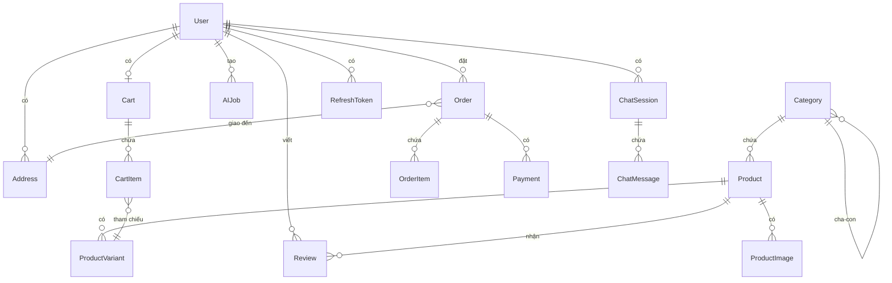

# Sơ Đồ Cơ Sở Dữ Liệu - Ứng Dụng Web Bán Quần Áo AI

Tài liệu mô tả chi tiết cấu trúc cơ sở dữ liệu PostgreSQL.

---

## Tổng Quan



---

## Chi Tiết Các Bảng

### 1. Quản Lý Người Dùng

#### users

| Cột            | Kiểu      | Mô tả                |
| -------------- | --------- | -------------------- |
| id             | VARCHAR   | Primary key (CUID)   |
| email          | VARCHAR   | Email duy nhất       |
| password       | VARCHAR   | Mật khẩu đã hash     |
| first_name     | VARCHAR   | Họ                   |
| last_name      | VARCHAR   | Tên                  |
| phone          | VARCHAR   | Số điện thoại        |
| avatar         | VARCHAR   | URL ảnh đại diện     |
| role           | ENUM      | USER / ADMIN         |
| is_active      | BOOLEAN   | Trạng thái hoạt động |
| email_verified | BOOLEAN   | Đã xác minh email    |
| height         | FLOAT     | Chiều cao (cm)       |
| weight         | FLOAT     | Cân nặng (kg)        |
| chest          | FLOAT     | Vòng ngực (cm)       |
| waist          | FLOAT     | Vòng eo (cm)         |
| hips           | FLOAT     | Vòng hông (cm)       |
| created_at     | TIMESTAMP | Thời gian tạo        |
| updated_at     | TIMESTAMP | Thời gian cập nhật   |

#### addresses

| Cột         | Kiểu    | Mô tả            |
| ----------- | ------- | ---------------- |
| id          | VARCHAR | Primary key      |
| user_id     | VARCHAR | FK → users       |
| full_name   | VARCHAR | Tên người nhận   |
| phone       | VARCHAR | SĐT người nhận   |
| street      | VARCHAR | Địa chỉ chi tiết |
| ward        | VARCHAR | Phường/Xã        |
| district    | VARCHAR | Quận/Huyện       |
| city        | VARCHAR | Thành phố        |
| province    | VARCHAR | Tỉnh             |
| postal_code | VARCHAR | Mã bưu chính     |
| is_default  | BOOLEAN | Địa chỉ mặc định |

#### refresh_tokens

| Cột        | Kiểu      | Mô tả             |
| ---------- | --------- | ----------------- |
| id         | VARCHAR   | Primary key       |
| token      | VARCHAR   | Token duy nhất    |
| user_id    | VARCHAR   | FK → users        |
| expires_at | TIMESTAMP | Thời gian hết hạn |
| created_at | TIMESTAMP | Thời gian tạo     |

---

### 2. Quản Lý Sản Phẩm

#### categories

| Cột         | Kiểu    | Mô tả                  |
| ----------- | ------- | ---------------------- |
| id          | VARCHAR | Primary key            |
| name        | VARCHAR | Tên danh mục           |
| slug        | VARCHAR | Slug URL duy nhất      |
| description | TEXT    | Mô tả                  |
| image       | VARCHAR | URL hình ảnh           |
| parent_id   | VARCHAR | FK → categories (self) |
| is_active   | BOOLEAN | Trạng thái             |
| sort_order  | INT     | Thứ tự sắp xếp         |

#### products

| Cột         | Kiểu          | Mô tả               |
| ----------- | ------------- | ------------------- |
| id          | VARCHAR       | Primary key         |
| name        | VARCHAR       | Tên sản phẩm        |
| slug        | VARCHAR       | Slug URL duy nhất   |
| description | TEXT          | Mô tả chi tiết      |
| price       | DECIMAL(12,2) | Giá gốc             |
| sale_price  | DECIMAL(12,2) | Giá khuyến mãi      |
| sku         | VARCHAR       | Mã sản phẩm         |
| brand       | VARCHAR       | Thương hiệu         |
| material    | VARCHAR       | Chất liệu           |
| category_id | VARCHAR       | FK → categories     |
| is_active   | BOOLEAN       | Đang bán            |
| is_featured | BOOLEAN       | Nổi bật             |
| size_guide  | JSON          | Bảng hướng dẫn size |

#### product_images

| Cột        | Kiểu    | Mô tả         |
| ---------- | ------- | ------------- |
| id         | VARCHAR | Primary key   |
| product_id | VARCHAR | FK → products |
| url        | VARCHAR | URL hình ảnh  |
| alt        | VARCHAR | Alt text      |
| sort_order | INT     | Thứ tự        |
| is_main    | BOOLEAN | Ảnh chính     |

#### product_variants

| Cột        | Kiểu    | Mô tả                     |
| ---------- | ------- | ------------------------- |
| id         | VARCHAR | Primary key               |
| product_id | VARCHAR | FK → products             |
| size       | ENUM    | XS/S/M/L/XL/XXL/XXXL/FREE |
| color      | VARCHAR | Tên màu                   |
| color_code | VARCHAR | Mã màu HEX                |
| stock      | INT     | Số lượng tồn kho          |
| sku        | VARCHAR | SKU biến thể              |

#### reviews

| Cột        | Kiểu    | Mô tả              |
| ---------- | ------- | ------------------ |
| id         | VARCHAR | Primary key        |
| user_id    | VARCHAR | FK → users         |
| product_id | VARCHAR | FK → products      |
| rating     | INT     | Đánh giá 1-5 sao   |
| title      | VARCHAR | Tiêu đề            |
| content    | TEXT    | Nội dung           |
| is_visible | BOOLEAN | Hiển thị công khai |

---

### 3. Giỏ Hàng

#### carts

| Cột        | Kiểu      | Mô tả               |
| ---------- | --------- | ------------------- |
| id         | VARCHAR   | Primary key         |
| user_id    | VARCHAR   | FK → users (unique) |
| created_at | TIMESTAMP | Thời gian tạo       |
| updated_at | TIMESTAMP | Thời gian cập nhật  |

#### cart_items

| Cột        | Kiểu    | Mô tả                 |
| ---------- | ------- | --------------------- |
| id         | VARCHAR | Primary key           |
| cart_id    | VARCHAR | FK → carts            |
| product_id | VARCHAR | FK → products         |
| variant_id | VARCHAR | FK → product_variants |
| quantity   | INT     | Số lượng              |

---

### 4. Đơn Hàng & Thanh Toán

#### orders

| Cột              | Kiểu          | Mô tả                  |
| ---------------- | ------------- | ---------------------- |
| id               | VARCHAR       | Primary key            |
| order_number     | VARCHAR       | Mã đơn hàng duy nhất   |
| user_id          | VARCHAR       | FK → users             |
| address_id       | VARCHAR       | FK → addresses         |
| status           | ENUM          | Trạng thái đơn hàng    |
| payment_method   | ENUM          | Phương thức thanh toán |
| payment_status   | ENUM          | Trạng thái thanh toán  |
| subtotal         | DECIMAL(12,2) | Tổng tiền hàng         |
| shipping_fee     | DECIMAL(12,2) | Phí vận chuyển         |
| discount         | DECIMAL(12,2) | Giảm giá               |
| total            | DECIMAL(12,2) | Tổng cộng              |
| note             | TEXT          | Ghi chú                |
| shipping_address | JSON          | Snapshot địa chỉ giao  |
| paid_at          | TIMESTAMP     | Thời gian thanh toán   |
| shipped_at       | TIMESTAMP     | Thời gian gửi hàng     |
| delivered_at     | TIMESTAMP     | Thời gian giao hàng    |
| cancelled_at     | TIMESTAMP     | Thời gian hủy          |

**Order Status:**

- `PENDING` - Chờ xử lý
- `CONFIRMED` - Đã xác nhận
- `PROCESSING` - Đang xử lý
- `SHIPPED` - Đã gửi hàng
- `DELIVERED` - Đã giao
- `CANCELLED` - Đã hủy
- `REFUNDED` - Đã hoàn tiền

**Payment Method:**

- `COD` - Thanh toán khi nhận hàng
- `BANK` - Chuyển khoản ngân hàng
- `MOMO` - Ví MoMo
- `ZALOPAY` - Ví ZaloPay

#### order_items

| Cột           | Kiểu          | Mô tả                 |
| ------------- | ------------- | --------------------- |
| id            | VARCHAR       | Primary key           |
| order_id      | VARCHAR       | FK → orders           |
| product_id    | VARCHAR       | FK → products         |
| variant_id    | VARCHAR       | FK → product_variants |
| product_name  | VARCHAR       | Snapshot tên SP       |
| product_image | VARCHAR       | Snapshot ảnh SP       |
| size          | ENUM          | Size đã chọn          |
| color         | VARCHAR       | Màu đã chọn           |
| quantity      | INT           | Số lượng              |
| unit_price    | DECIMAL(12,2) | Đơn giá               |
| total_price   | DECIMAL(12,2) | Thành tiền            |

#### payments

| Cột              | Kiểu          | Mô tả                  |
| ---------------- | ------------- | ---------------------- |
| id               | VARCHAR       | Primary key            |
| order_id         | VARCHAR       | FK → orders            |
| method           | ENUM          | Phương thức            |
| status           | ENUM          | Trạng thái             |
| amount           | DECIMAL(12,2) | Số tiền                |
| transaction_id   | VARCHAR       | Mã giao dịch từ cổng   |
| gateway_response | JSON          | Response từ cổng       |
| bank_code        | VARCHAR       | Mã ngân hàng           |
| reference_code   | VARCHAR       | Mã tham chiếu (unique) |
| completed_at     | TIMESTAMP     | Thời gian hoàn thành   |

---

### 5. Tính Năng AI

#### ai_jobs

| Cột           | Kiểu      | Mô tả                                         |
| ------------- | --------- | --------------------------------------------- |
| id            | VARCHAR   | Primary key                                   |
| user_id       | VARCHAR   | FK → users                                    |
| type          | ENUM      | VIRTUAL_TRYON / SIZE_RECOMMEND / CHAT_SUPPORT |
| status        | ENUM      | PENDING / PROCESSING / COMPLETED / FAILED     |
| input_data    | JSON      | Dữ liệu đầu vào                               |
| result_data   | JSON      | Kết quả xử lý                                 |
| result_url    | VARCHAR   | URL kết quả (ảnh)                             |
| error_message | VARCHAR   | Thông báo lỗi                                 |
| product_id    | VARCHAR   | FK → products                                 |
| started_at    | TIMESTAMP | Bắt đầu xử lý                                 |
| completed_at  | TIMESTAMP | Hoàn thành                                    |

#### chat_sessions

| Cột       | Kiểu    | Mô tả          |
| --------- | ------- | -------------- |
| id        | VARCHAR | Primary key    |
| user_id   | VARCHAR | FK → users     |
| title     | VARCHAR | Tiêu đề phiên  |
| is_active | BOOLEAN | Đang hoạt động |

#### chat_messages

| Cột        | Kiểu    | Mô tả                     |
| ---------- | ------- | ------------------------- |
| id         | VARCHAR | Primary key               |
| session_id | VARCHAR | FK → chat_sessions        |
| role       | ENUM    | USER / ASSISTANT / SYSTEM |
| content    | TEXT    | Nội dung tin nhắn         |
| metadata   | JSON    | Metadata bổ sung          |

---

### 6. Cấu Hình

#### settings

| Cột   | Kiểu    | Mô tả                  |
| ----- | ------- | ---------------------- |
| id    | VARCHAR | Primary key            |
| key   | VARCHAR | Khóa cấu hình (unique) |
| value | JSON    | Giá trị                |
| group | VARCHAR | Nhóm cấu hình          |

---

## Indexes

```sql
-- Users
CREATE INDEX idx_users_email ON users(email);
CREATE INDEX idx_users_role ON users(role);

-- Products
CREATE INDEX idx_products_category ON products(category_id);
CREATE INDEX idx_products_active_featured ON products(is_active, is_featured);
CREATE INDEX idx_products_slug ON products(slug);

-- Orders
CREATE INDEX idx_orders_user ON orders(user_id);
CREATE INDEX idx_orders_status ON orders(status);
CREATE INDEX idx_orders_number ON orders(order_number);

-- Payments
CREATE INDEX idx_payments_order ON payments(order_id);
CREATE INDEX idx_payments_reference ON payments(reference_code);

-- AI Jobs
CREATE INDEX idx_ai_jobs_user ON ai_jobs(user_id);
CREATE INDEX idx_ai_jobs_status ON ai_jobs(status);
```

---

## Quan Hệ Chính

| Từ       | Đến            | Loại | Mô tả                   |
| -------- | -------------- | ---- | ----------------------- |
| User     | Cart           | 1:1  | Mỗi user có 1 giỏ hàng  |
| User     | Order          | 1:N  | User có nhiều đơn hàng  |
| User     | Address        | 1:N  | User có nhiều địa chỉ   |
| Category | Category       | Self | Danh mục cha-con        |
| Category | Product        | 1:N  | Danh mục chứa nhiều SP  |
| Product  | ProductVariant | 1:N  | SP có nhiều biến thể    |
| Order    | OrderItem      | 1:N  | Đơn hàng có nhiều items |
| Order    | Payment        | 1:N  | Đơn có nhiều thanh toán |
