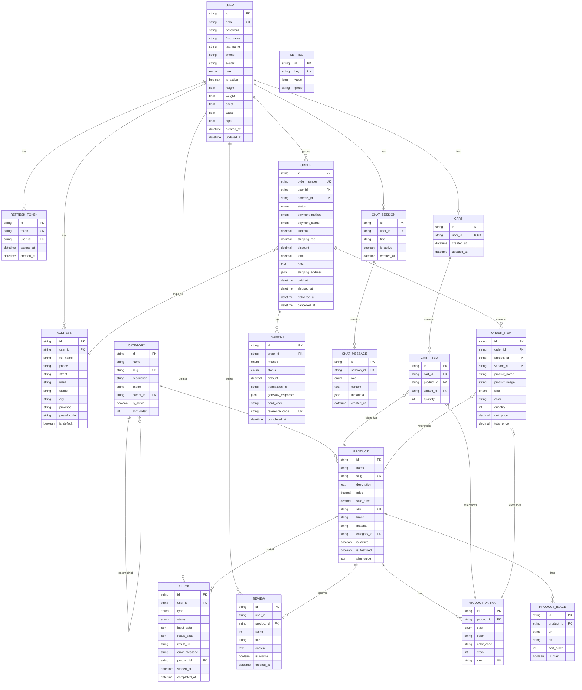
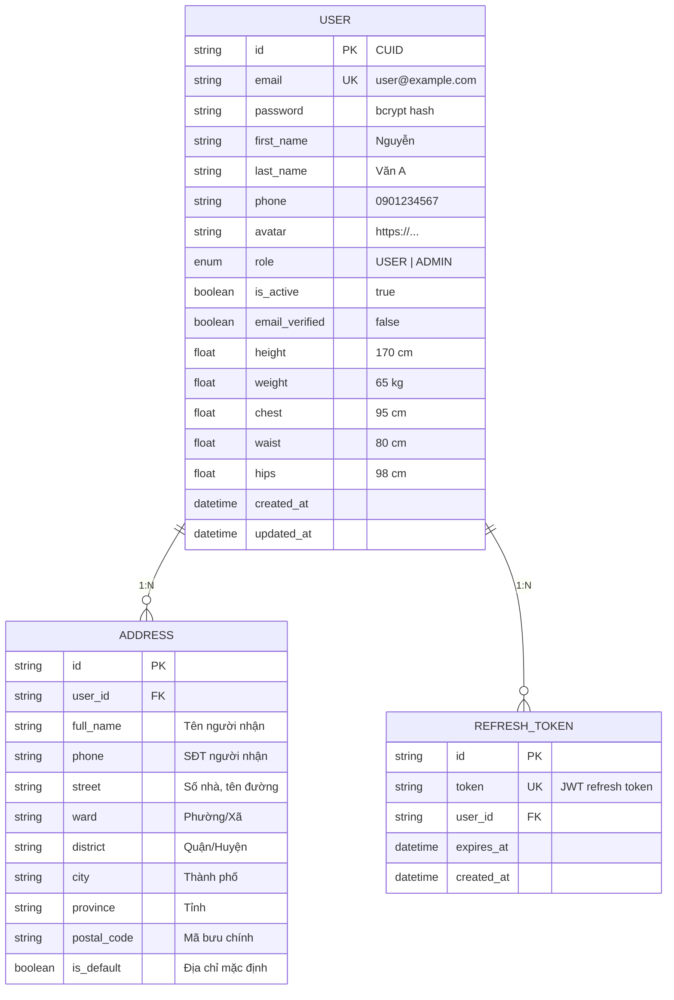
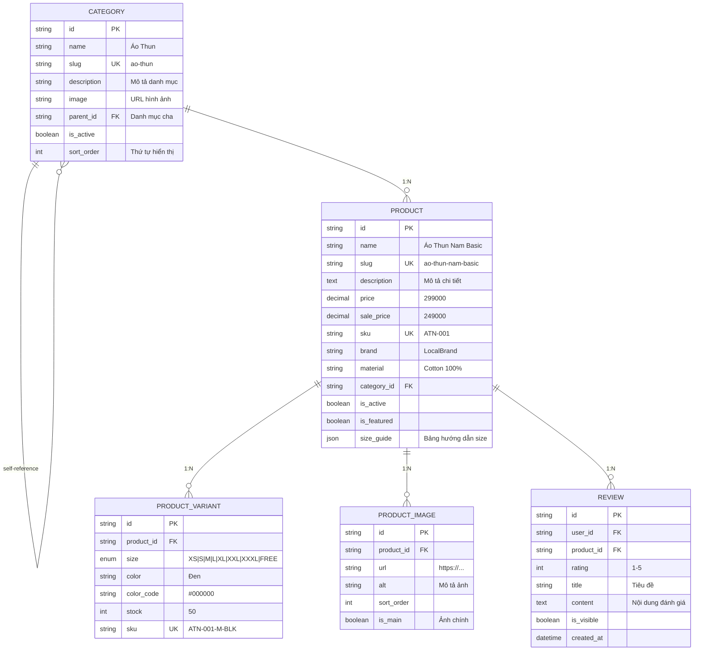
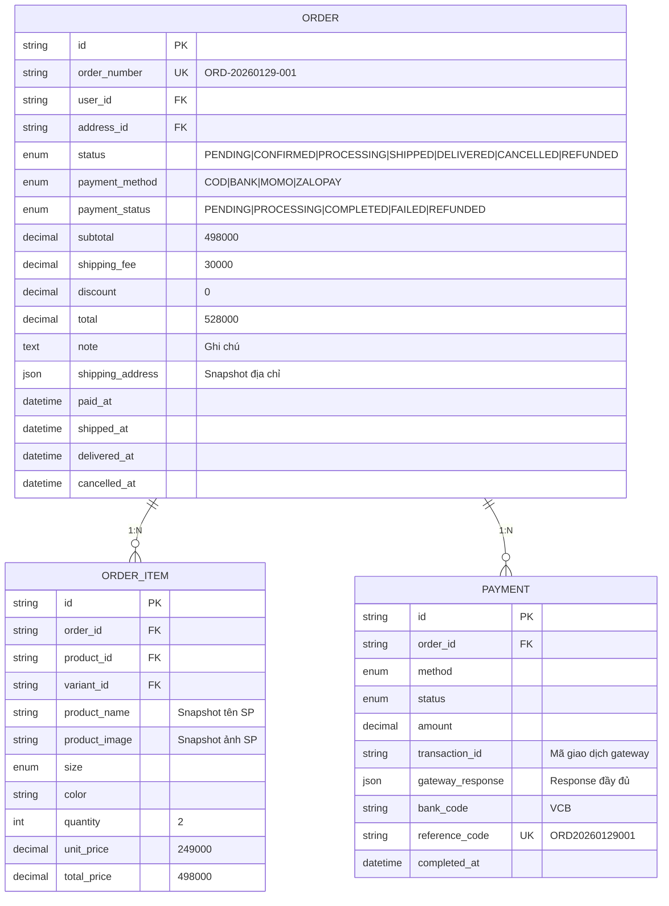
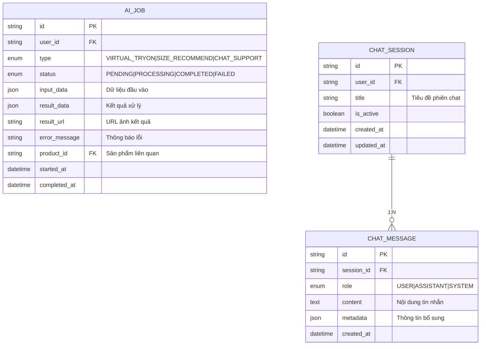

# ERD - Entity Relationship Diagram

Sơ đồ quan hệ thực thể chi tiết cho hệ thống thương mại điện tử.

---

## 1. ERD Tổng Quan



---

## 2. ERD Chi Tiết Theo Domain

### 2.1. User Domain



### 2.2. Product Domain



### 2.3. Order Domain



### 2.4. AI Domain



---

## 3. Cardinality Rules

| Quan hệ                   | Cardinality | Mô tả                          |
| ------------------------- | ----------- | ------------------------------ |
| User - Cart               | 1:1         | Mỗi user có đúng 1 giỏ hàng    |
| User - Address            | 1:N         | User có nhiều địa chỉ          |
| User - Order              | 1:N         | User có nhiều đơn hàng         |
| Category - Category       | 1:N (self)  | Danh mục cha-con               |
| Category - Product        | 1:N         | Danh mục chứa nhiều SP         |
| Product - ProductVariant  | 1:N         | SP có nhiều biến thể           |
| Product - ProductImage    | 1:N         | SP có nhiều ảnh                |
| Cart - CartItem           | 1:N         | Giỏ hàng có nhiều items        |
| Order - OrderItem         | 1:N         | Đơn hàng có nhiều items        |
| Order - Payment           | 1:N         | Đơn có thể có nhiều thanh toán |
| ChatSession - ChatMessage | 1:N         | Phiên chat có nhiều tin nhắn   |

---

## 4. Database Indexes

```sql
-- Performance Indexes
CREATE INDEX idx_users_email ON users(email);
CREATE INDEX idx_products_category ON products(category_id);
CREATE INDEX idx_products_slug ON products(slug);
CREATE INDEX idx_products_active_featured ON products(is_active, is_featured);
CREATE INDEX idx_orders_user ON orders(user_id);
CREATE INDEX idx_orders_status ON orders(status);
CREATE INDEX idx_orders_number ON orders(order_number);
CREATE INDEX idx_payments_order ON payments(order_id);
CREATE INDEX idx_payments_reference ON payments(reference_code);
CREATE INDEX idx_ai_jobs_user ON ai_jobs(user_id);
CREATE INDEX idx_ai_jobs_status ON ai_jobs(status);
CREATE INDEX idx_chat_messages_session ON chat_messages(session_id);

-- Full-text Search
CREATE INDEX idx_products_name_gin ON products USING gin(to_tsvector('vietnamese', name));
CREATE INDEX idx_products_description_gin ON products USING gin(to_tsvector('vietnamese', description));
```
