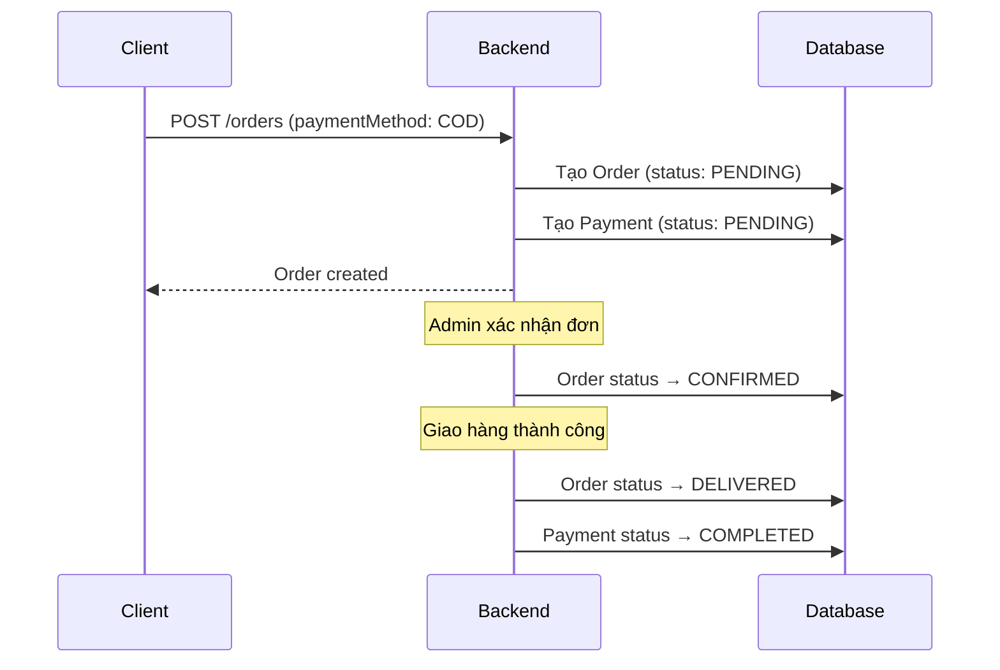
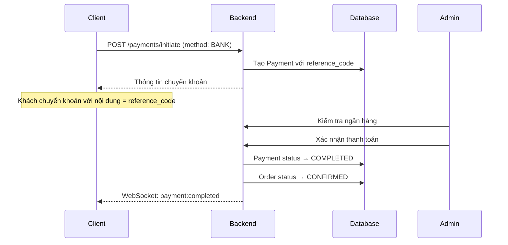
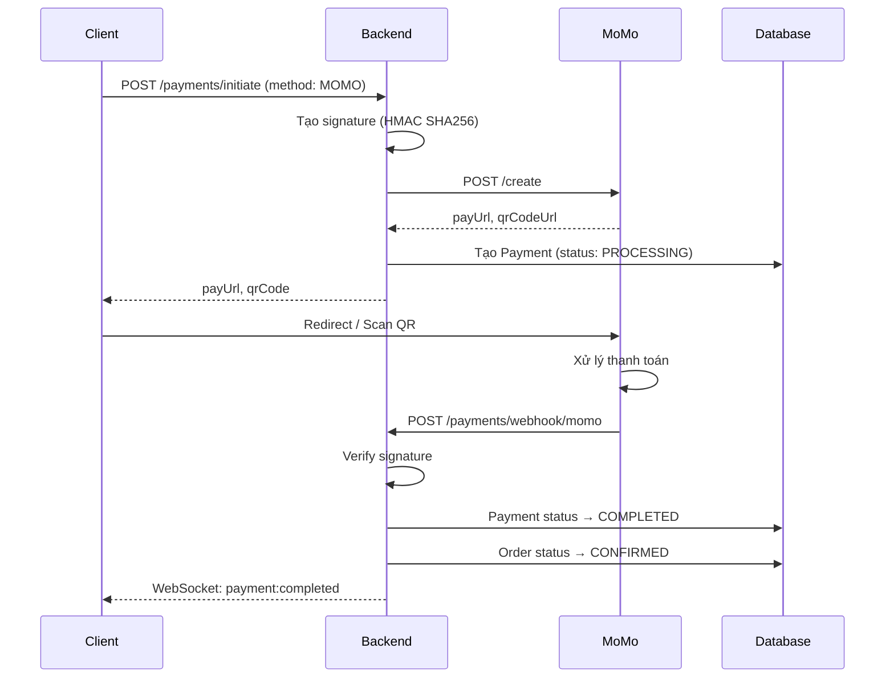
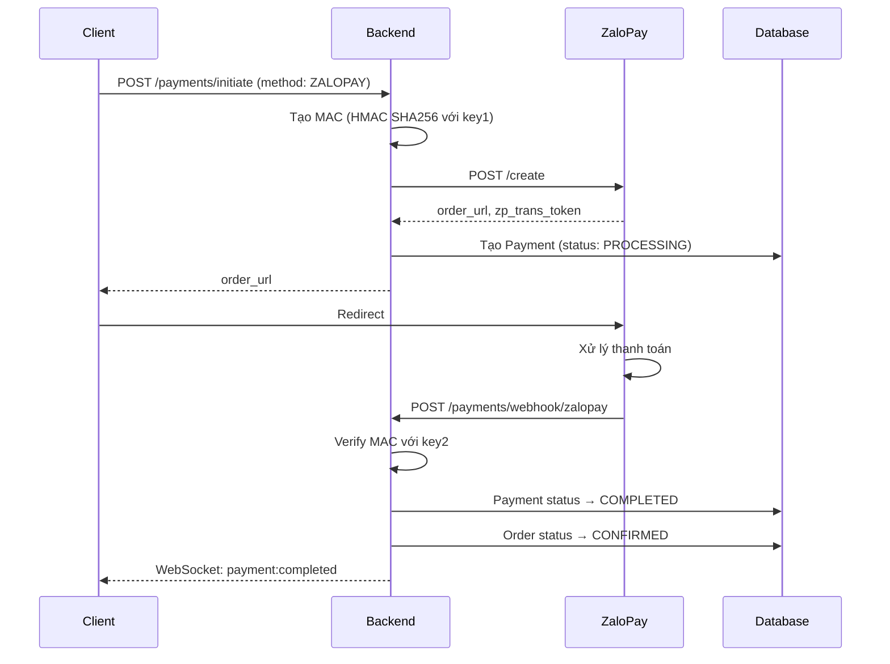
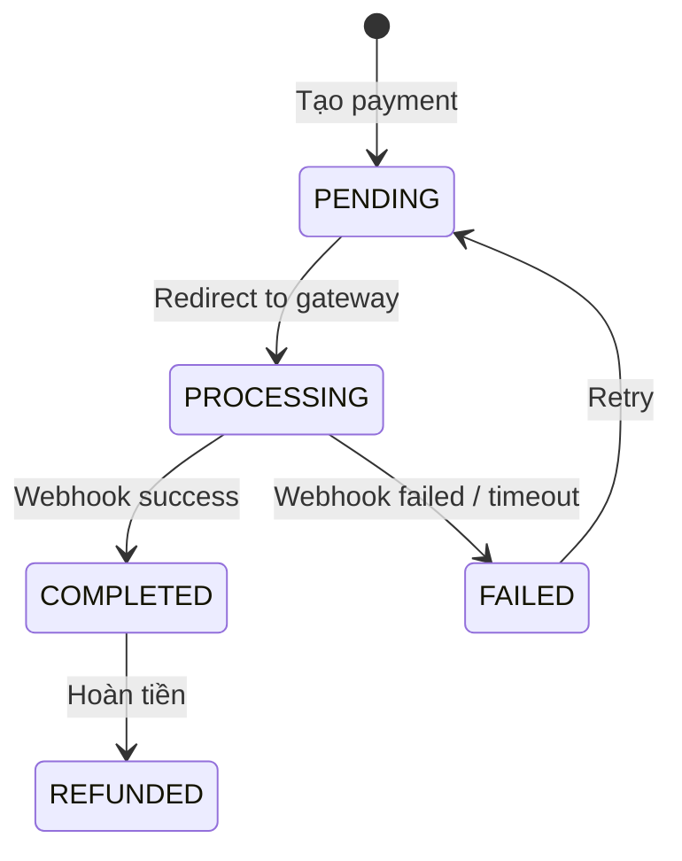
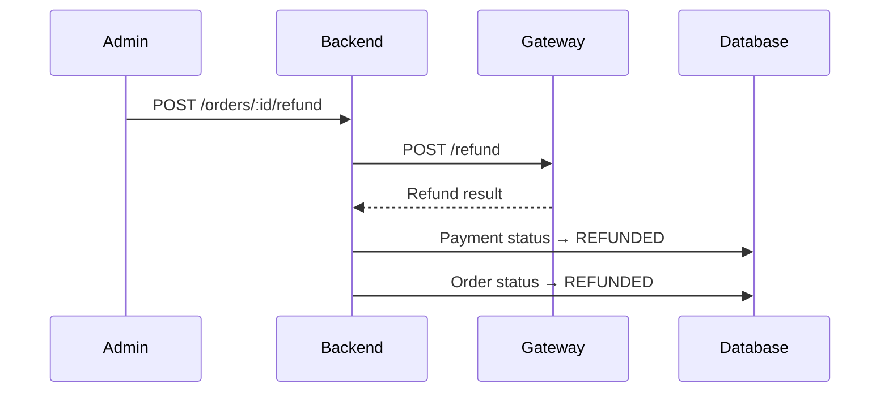

# Luồng Thanh Toán - Ứng Dụng Web Bán Quần Áo AI

Tài liệu chi tiết các phương thức thanh toán và luồng xử lý.

---

## Tổng Quan Phương Thức Thanh Toán

| Phương thức   | Mô tả                    | Xử lý                 |
| ------------- | ------------------------ | --------------------- |
| COD           | Thanh toán khi nhận hàng | Đồng bộ               |
| Bank Transfer | Chuyển khoản ngân hàng   | Bán đồng bộ           |
| MoMo          | Ví điện tử MoMo          | Bất đồng bộ (Webhook) |
| ZaloPay       | Ví điện tử ZaloPay       | Bất đồng bộ (Webhook) |

---

## 1. COD (Thanh Toán Khi Nhận Hàng)

### Luồng Xử Lý



### Đặc điểm

- Không cần xác minh thanh toán trước
- Rủi ro: Khách từ chối nhận hàng
- Payment hoàn thành khi giao hàng xong

---

## 2. Bank Transfer (Chuyển Khoản Ngân Hàng)

### Luồng Xử Lý



### Thông Tin Chuyển Khoản

```json
{
  "bankName": "Vietcombank",
  "accountNumber": "1234567890",
  "accountName": "CONG TY TNHH ABC",
  "amount": 528000,
  "referenceCode": "ORD20260129001",
  "expireAt": "2026-01-30T22:00:00Z"
}
```

### Reference Code Format

```
ORD + YYYYMMDD + sequence_number
Ví dụ: ORD20260129001, ORD20260129002
```

---

## 3. MoMo

### Cấu Hình

```typescript
// .env
MOMO_PARTNER_CODE=your_partner_code
MOMO_ACCESS_KEY=your_access_key
MOMO_SECRET_KEY=your_secret_key
MOMO_ENDPOINT=https://test-payment.momo.vn/v2/gateway/api
```

### Luồng Xử Lý



### Signature Generation

```typescript
const rawSignature = [
  `accessKey=${accessKey}`,
  `amount=${amount}`,
  `extraData=${extraData}`,
  `ipnUrl=${ipnUrl}`,
  `orderId=${orderId}`,
  `orderInfo=${orderInfo}`,
  `partnerCode=${partnerCode}`,
  `redirectUrl=${redirectUrl}`,
  `requestId=${requestId}`,
  `requestType=${requestType}`,
].join("&");

const signature = crypto
  .createHmac("sha256", secretKey)
  .update(rawSignature)
  .digest("hex");
```

### Webhook Payload

```json
{
  "partnerCode": "MOMO",
  "orderId": "ORD20260129001",
  "requestId": "req_123",
  "amount": 528000,
  "orderInfo": "Thanh toán đơn hàng #ORD20260129001",
  "orderType": "momo_wallet",
  "transId": 123456789,
  "resultCode": 0,
  "message": "Thành công",
  "payType": "qr",
  "responseTime": 1706550000000,
  "extraData": "",
  "signature": "abc123..."
}
```

### Result Codes

| Code | Mô tả                            |
| ---- | -------------------------------- |
| 0    | Thành công                       |
| 9000 | Giao dịch được khởi tạo          |
| 1001 | Giao dịch thất bại do thiếu tiền |
| 1002 | Giao dịch bị từ chối             |
| 1003 | Giao dịch bị hủy                 |

---

## 4. ZaloPay

### Cấu Hình

```typescript
// .env
ZALOPAY_APP_ID=your_app_id
ZALOPAY_KEY1=your_key1
ZALOPAY_KEY2=your_key2
ZALOPAY_ENDPOINT=https://sb-openapi.zalopay.vn/v2
```

### Luồng Xử Lý



### MAC Generation (Create Order)

```typescript
const data = `${app_id}|${app_trans_id}|${app_user}|${amount}|${app_time}|${embed_data}|${item}`;
const mac = crypto.createHmac("sha256", key1).update(data).digest("hex");
```

### Webhook Verification

```typescript
const data = `${data.app_id}|${data.app_trans_id}|${data.app_time}|${data.app_user}|${data.amount}|${data.embed_data}|${data.item}`;
const expectedMac = crypto
  .createHmac("sha256", key2)
  .update(data)
  .digest("hex");

if (expectedMac !== data.mac) {
  throw new Error("Invalid signature");
}
```

---

## Webhook Security

### IP Whitelist

```typescript
// MoMo IPs
const MOMO_IPS = [
  "118.69.212.158",
  "118.69.212.159",
  // ... production IPs
];

// ZaloPay IPs
const ZALOPAY_IPS = [
  "113.160.92.202",
  // ... production IPs
];
```

### Idempotency

```typescript
@Post('webhook/momo')
async handleMoMoWebhook(@Body() data: MoMoCallback) {
  // Kiểm tra đã xử lý chưa
  const existing = await this.paymentService.findByTransactionId(data.transId);
  if (existing && existing.status === 'COMPLETED') {
    return { returnCode: 0, returnMessage: 'Already processed' };
  }

  // Xử lý thanh toán
  await this.paymentService.complete(data);

  return { returnCode: 0, returnMessage: 'Success' };
}
```

---

## Payment State Machine



---

## Xử Lý Lỗi

### Retry Strategy

```typescript
// Webhook không thành công → Gateway sẽ retry
// MoMo: 5 lần trong 24h
// ZaloPay: 3 lần trong 1h

// Backend phải đảm bảo idempotency
```

### Timeout Handling

```typescript
// Cron job kiểm tra payment quá hạn
@Cron('*/5 * * * *')
async checkExpiredPayments() {
  const expiredPayments = await this.paymentService.findExpired();

  for (const payment of expiredPayments) {
    // Query trạng thái từ gateway
    const status = await this.queryPaymentStatus(payment);

    if (status === 'SUCCESS') {
      await this.paymentService.complete(payment);
    } else if (status === 'FAILED' || isExpired) {
      await this.paymentService.fail(payment);
    }
  }
}
```

---

## Hoàn Tiền (Refund)

### Điều kiện hoàn tiền

- Đơn hàng bị hủy sau khi đã thanh toán
- Sản phẩm hết hàng
- Khiếu nại của khách hàng

### Luồng hoàn tiền



---

## Báo Cáo & Đối Soát

### Dữ liệu lưu trữ

```json
{
  "payment": {
    "id": "clx...",
    "orderId": "clx...",
    "method": "MOMO",
    "amount": 528000,
    "transactionId": "123456789",
    "gatewayResponse": {
      "resultCode": 0,
      "message": "Thành công",
      "transId": 123456789,
      "responseTime": 1706550000000
    }
  }
}
```

### Đối soát hàng ngày

1. Export danh sách giao dịch từ gateway
2. So khớp với database
3. Xử lý các giao dịch không khớp
