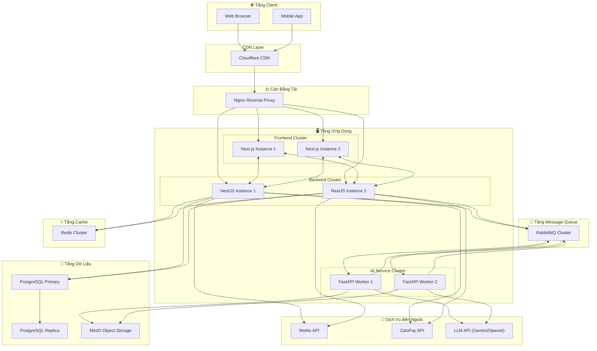
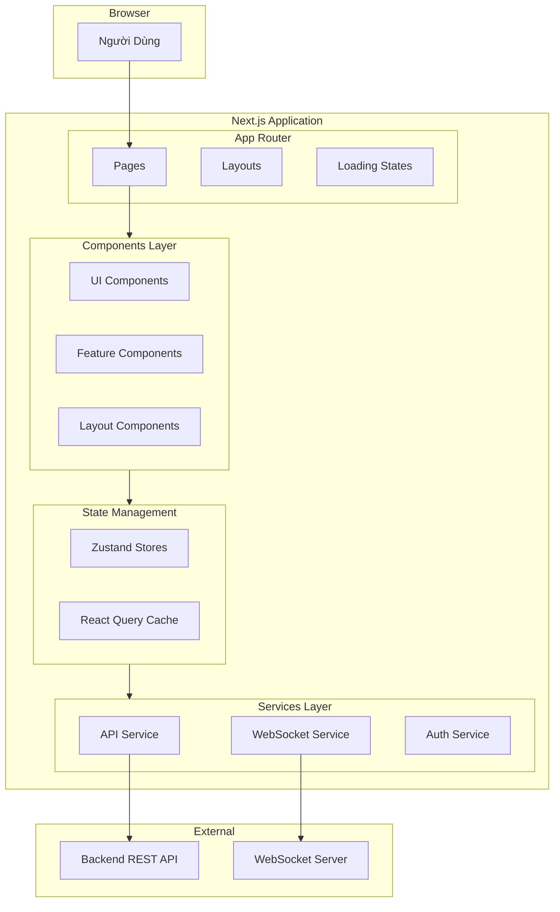
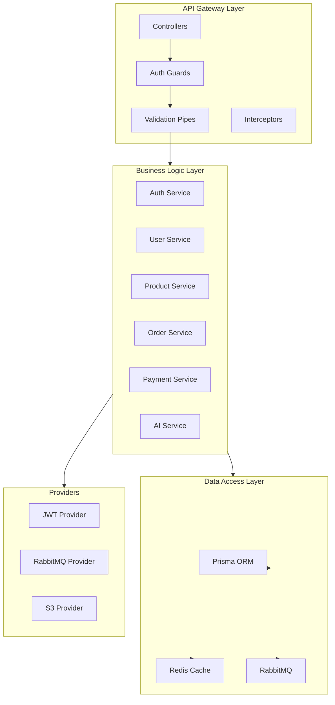
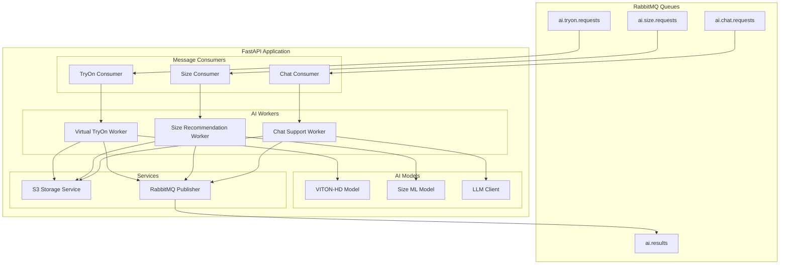
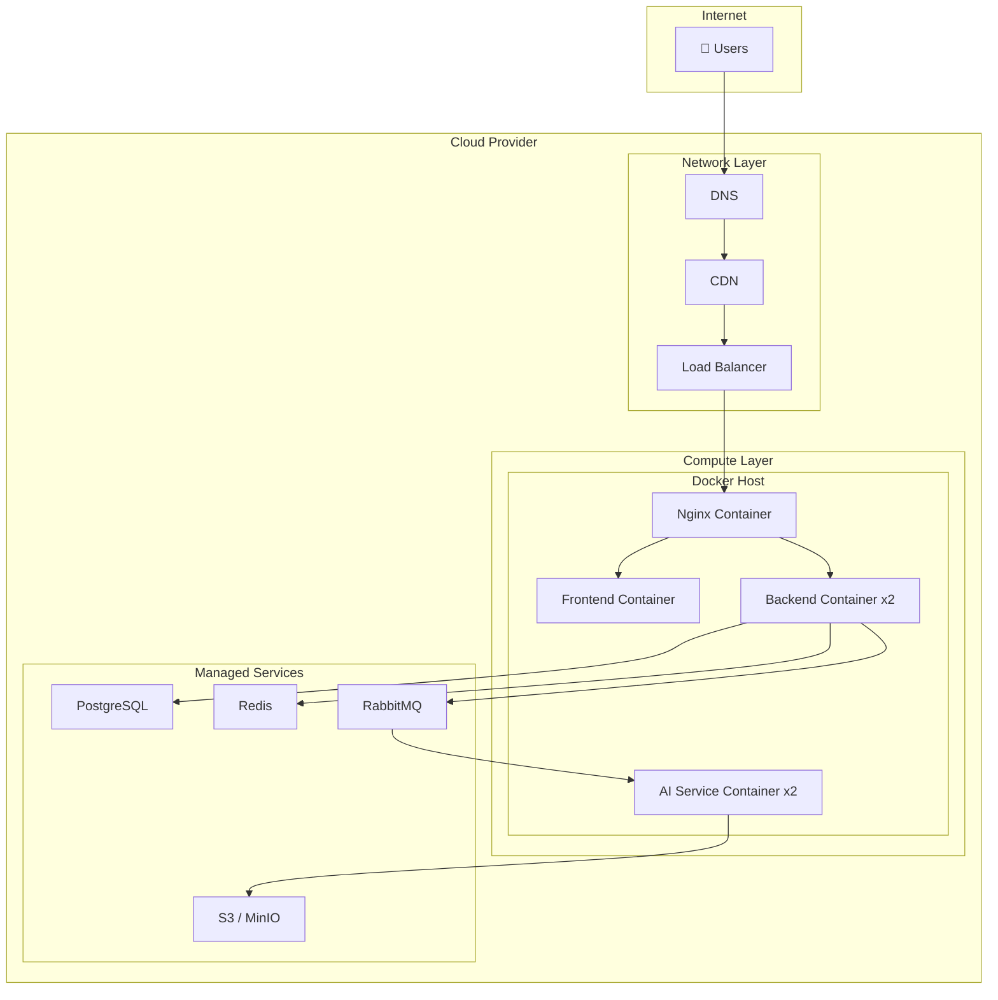
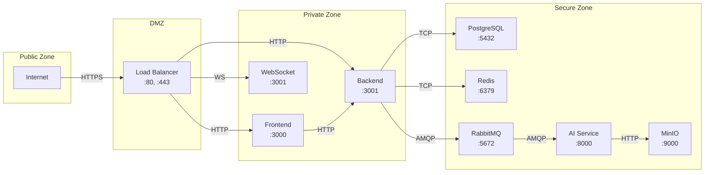
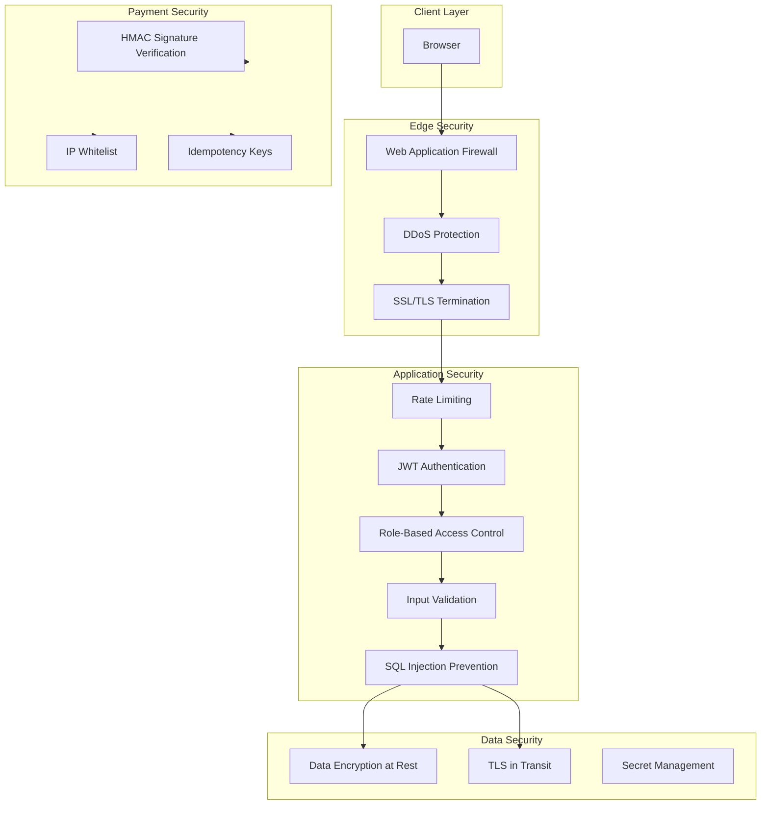
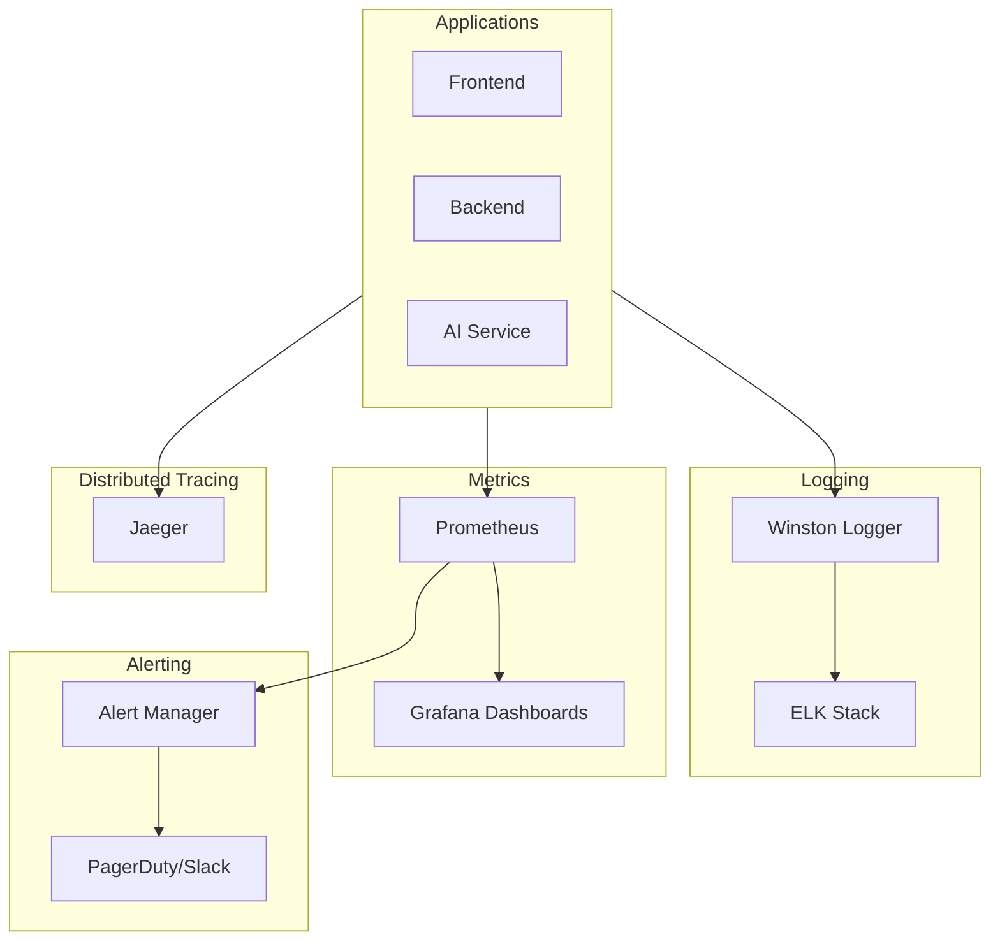

# Sơ Đồ Kiến Trúc Hệ Thống

Tài liệu mô tả chi tiết kiến trúc hệ thống với các sơ đồ trực quan.

---

## 1. Kiến Trúc Tổng Thể (High-Level Architecture)

---

## 2. Kiến Trúc Chi Tiết Theo Component

### 2.1. Frontend Architecture

### 2.2. Backend Architecture (NestJS)

### 2.3. AI Service Architecture

---

## 3. Deployment Architecture

---

## 4. Network Flow Diagram

---

## 5. Security Architecture

---

## 6. Monitoring & Observability

