# UML Diagrams - Sơ Đồ Hành Vi

Tài liệu các sơ đồ UML tập trung vào hành vi hệ thống.

---

## 1. Use Case Diagram - Sơ Đồ Ca Sử Dụng

### 1.1. Use Case Tổng Quan

```mermaid
flowchart TB
    subgraph System["🛒 Hệ Thống Bán Quần Áo AI"]
        subgraph AuthUC["Xác Thực"]
            UC1["Đăng ký"]
            UC2["Đăng nhập"]
            UC3["Đăng xuất"]
            UC4["Quên mật khẩu"]
        end

        subgraph ProductUC["Sản Phẩm"]
            UC5["Xem danh sách SP"]
            UC6["Tìm kiếm SP"]
            UC7["Xem chi tiết SP"]
            UC8["Đánh giá SP"]
        end

        subgraph CartUC["Giỏ Hàng"]
            UC9["Thêm vào giỏ"]
            UC10["Cập nhật số lượng"]
            UC11["Xóa khỏi giỏ"]
            UC12["Xem giỏ hàng"]
        end

        subgraph OrderUC["Đơn Hàng"]
            UC13["Đặt hàng"]
            UC14["Thanh toán"]
            UC15["Xem lịch sử ĐH"]
            UC16["Hủy đơn hàng"]
        end

        subgraph AIUC["Tính Năng AI"]
            UC17["Thử đồ ảo"]
            UC18["Gợi ý kích thước"]
            UC19["Chat với AI"]
        end

        subgraph AdminUC["Quản Trị"]
            UC20["Quản lý sản phẩm"]
            UC21["Quản lý đơn hàng"]
            UC22["Quản lý người dùng"]
            UC23["Xem thống kê"]
        end
    end

    Guest["👤 Khách"]
    User["👤 Người Dùng"]
    Admin["👤 Quản Trị Viên"]

    Guest --> UC1 & UC2 & UC5 & UC6 & UC7
    User --> UC1 & UC2 & UC3 & UC4
    User --> UC5 & UC6 & UC7 & UC8
    User --> UC9 & UC10 & UC11 & UC12
    User --> UC13 & UC14 & UC15 & UC16
    User --> UC17 & UC18 & UC19
    Admin --> UC20 & UC21 & UC22 & UC23
```

### 1.2. Use Case Chi Tiết - Đặt Hàng

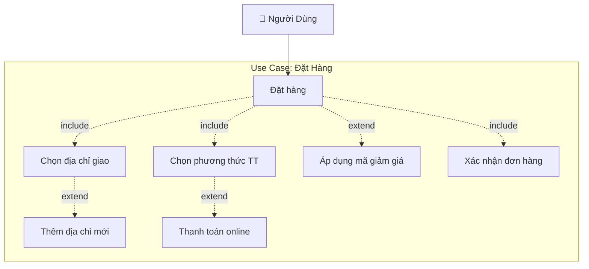

### 1.3. Use Case Chi Tiết - Tính Năng AI

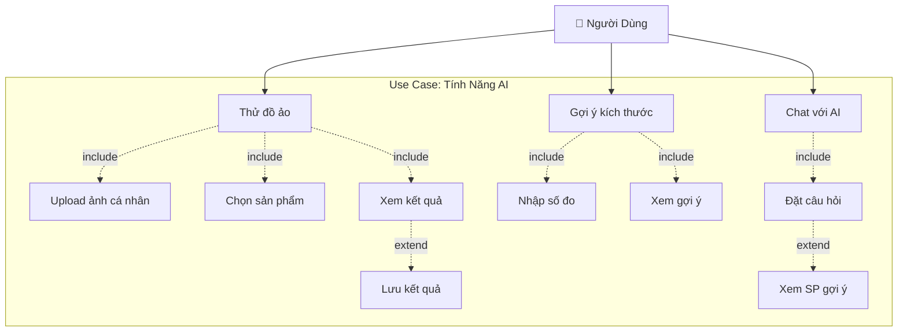

---

## 2. Sequence Diagram - Sơ Đồ Tuần Tự

### 2.1. Đăng Nhập & Xác Thực

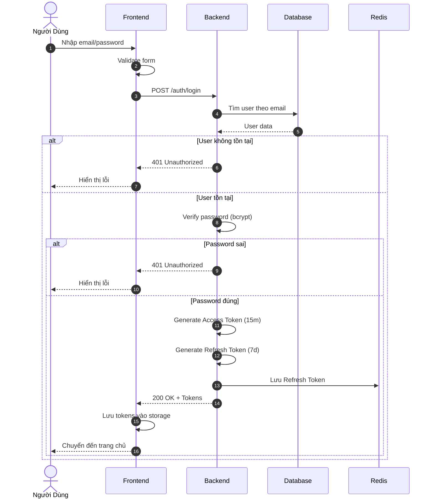

### 2.2. Đặt Hàng

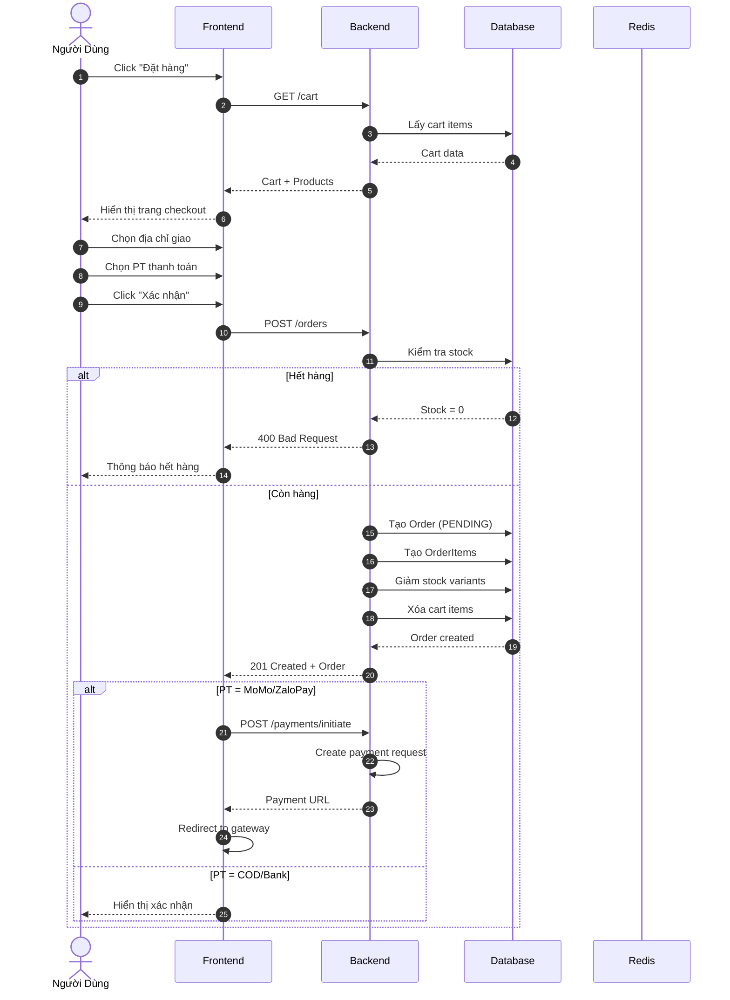

### 2.3. Thử Đồ Ảo (Virtual Try-On)

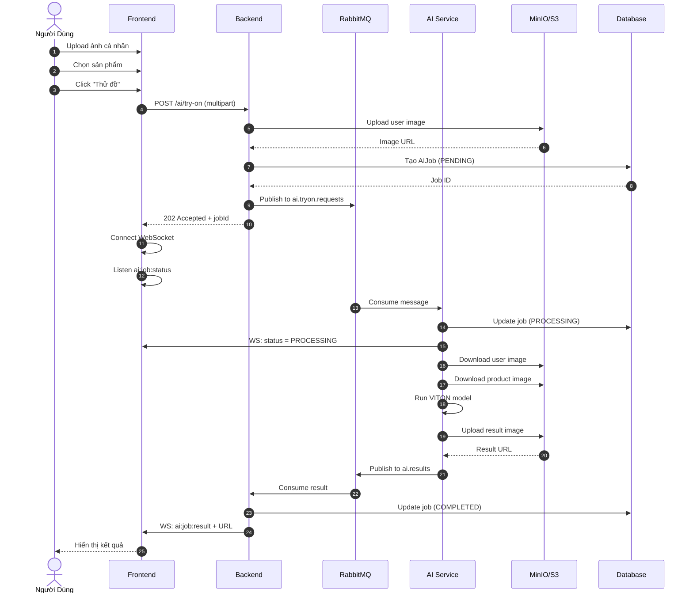

### 2.4. Thanh Toán MoMo

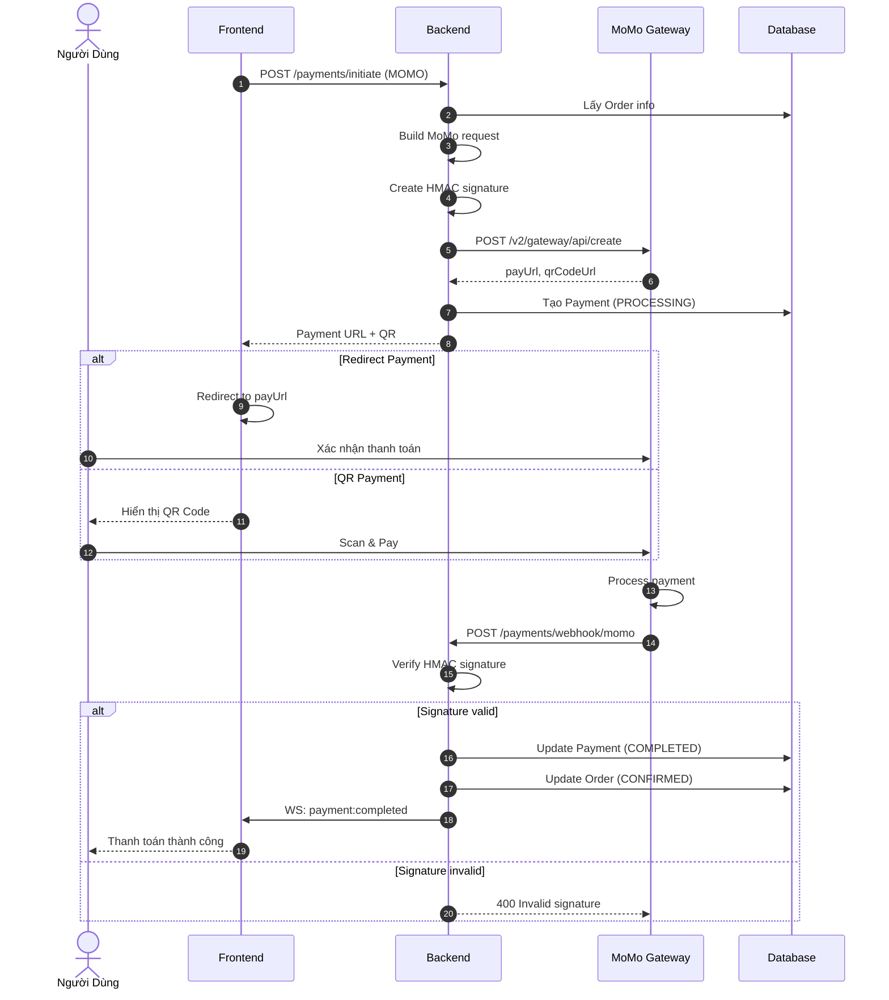

### 2.5. Chat với AI

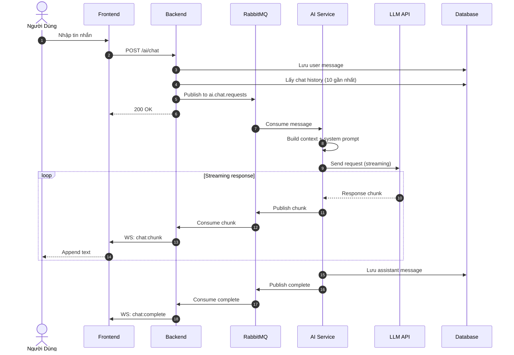

---

## 3. Activity Diagram - Sơ Đồ Hoạt Động

### 3.1. Luồng Mua Hàng

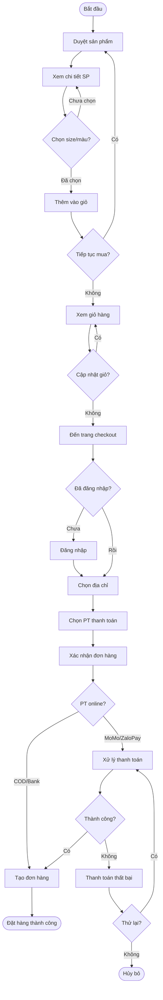

### 3.2. Luồng Xử Lý Đơn Hàng (Admin)

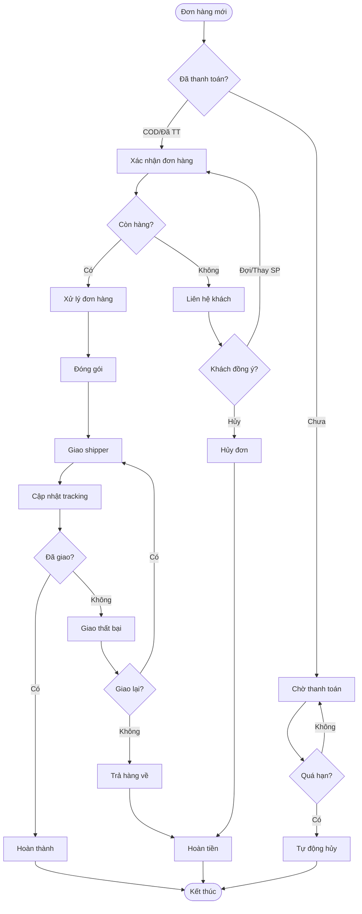

### 3.3. Luồng Thử Đồ Ảo

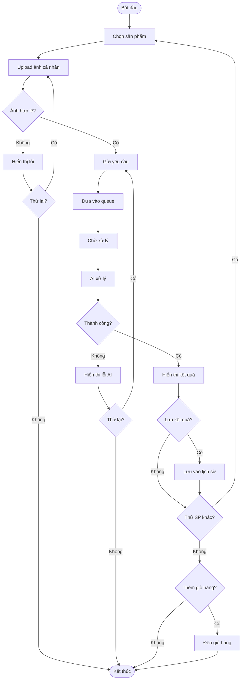

---

## 4. State Diagram - Sơ Đồ Trạng Thái

### 4.1. Trạng Thái Đơn Hàng

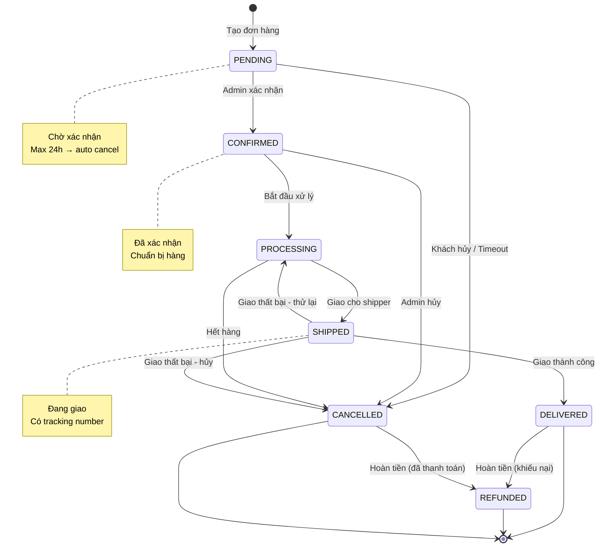

### 4.2. Trạng Thái Thanh Toán

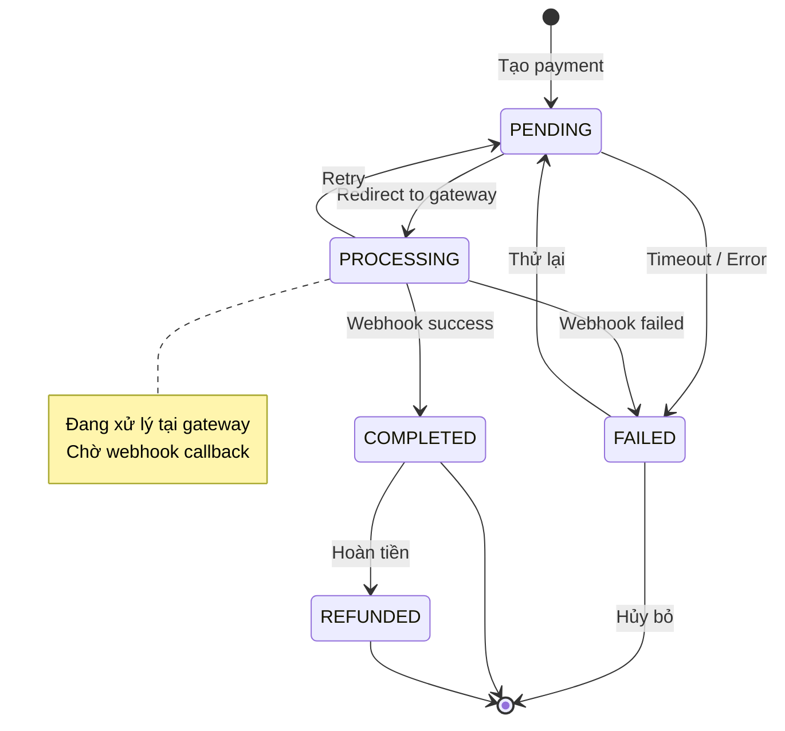

### 4.3. Trạng Thái AI Job

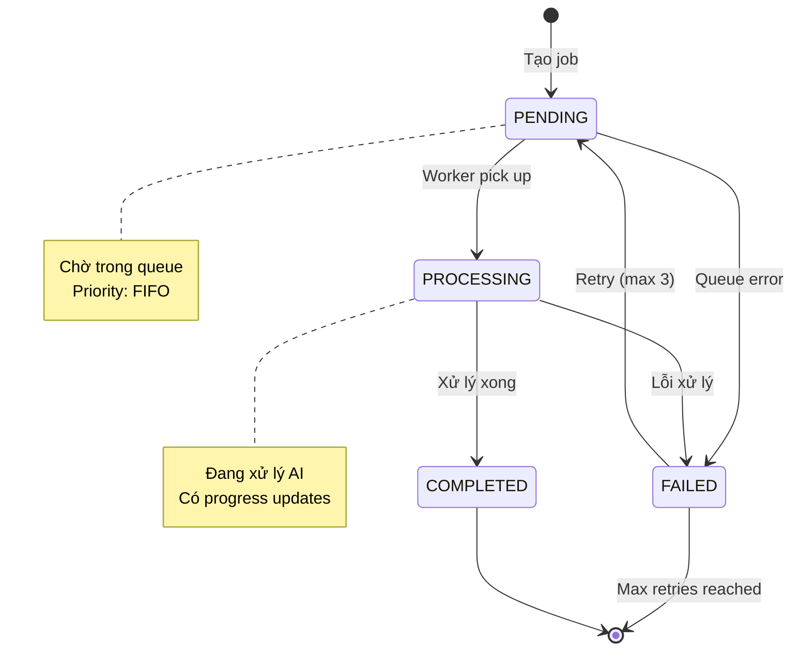

### 4.4. Trạng Thái Giỏ Hàng

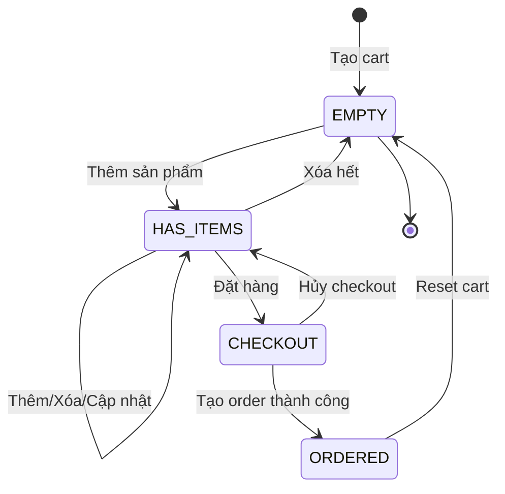
