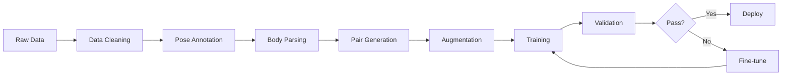

# Tài Liệu Kỹ Thuật: Tính Năng Thử Trang Phục Ảo (Virtual Try-on)

## Mục Lục

1. [Tổng Quan](#1-tổng-quan)
2. [Yêu Cầu Chức Năng](#2-yêu-cầu-chức-năng)
3. [Kiến Trúc Hệ Thống](#3-kiến-trúc-hệ-thống)
4. [Mô Hình AI & Training](#4-mô-hình-ai--training)
5. [Xử Lý Đa Dạng Ngoại Hình](#5-xử-lý-đa-dạng-ngoại-hình)
6. [Tối Ưu Trải Nghiệm Người Dùng](#6-tối-ưu-trải-nghiệm-người-dùng)
7. [Xử Lý Lỗi & An Toàn](#7-xử-lý-lỗi--an-toàn)
8. [Hiệu Suất & Tối Ưu](#8-hiệu-suất--tối-ưu)
9. [API Specification](#9-api-specification)
10. [Kế Hoạch Triển Khai](#10-kế-hoạch-triển-khai)
11. [Giới Hạn Kỹ Thuật & Disclaimer](#11-giới-hạn-kỹ-thuật--disclaimer)
12. [Cloud API Alternatives](#12-cloud-api-alternatives-không-cần-gpu)
13. [Testing Strategy Chi Tiết](#13-testing-strategy-chi-tiết)
14. [Metrics Đo Độ Hài Lòng](#14-metrics-đo-độ-hài-lòng-theo-body-type)
15. [Dataset Custom Vietnam](#15-dataset-custom-vietnam---chi-tiết)
16. [Accessibility Features](#16-accessibility-features)
17. [Mobile Experience](#17-mobile-experience)
18. [Testing Checklist Tổng Hợp](#18-testing-checklist-tổng-hợp)

---

## 1. Tổng Quan

### 1.1. Mô Tả Chức Năng

Tính năng **Thử Trang Phục Ảo (Virtual Try-on)** cho phép khách hàng:

- Upload ảnh của bản thân (hoặc chụp trực tiếp)
- Chọn sản phẩm quần áo muốn thử
- Xem trực tiếp hình ảnh sản phẩm được "mặc" lên người mình
- Thử nhiều sản phẩm, nhiều màu sắc, nhiều size khác nhau

### 1.2. Mục Tiêu

| Mục Tiêu                | Tiêu Chí Đo Lường           |
| ----------------------- | --------------------------- |
| **Trải nghiệm mượt mà** | Thời gian xử lý < 10 giây   |
| **Kết quả chính xác**   | Độ hài lòng > 85%           |
| **Đa dạng người dùng**  | Hỗ trợ mọi vóc dáng, màu da |
| **Tăng chuyển đổi**     | Tăng 20-30% tỷ lệ mua hàng  |
| **Giảm hoàn trả**       | Giảm 15-25% đơn hoàn        |

### 1.3. Lợi Ích Người Dùng

```
✅ Tiết kiệm thời gian: Không cần đến cửa hàng thử đồ
✅ Tự tin hơn: Xem trước sản phẩm trên người
✅ So sánh dễ dàng: Thử nhiều sản phẩm cùng lúc
✅ Mọi lúc mọi nơi: Thử đồ 24/7 tại nhà
```

---

## 2. Yêu Cầu Chức Năng

### 2.1. Chức Năng Chính

#### 2.1.1. Upload Ảnh Người Dùng

| Yêu Cầu                      | Chi Tiết                        |
| ---------------------------- | ------------------------------- |
| **Định dạng**                | JPEG, PNG, WebP                 |
| **Kích thước tối đa**        | 10MB                            |
| **Độ phân giải tối thiểu**   | 512x512 pixels                  |
| **Độ phân giải khuyến nghị** | 1024x1024 pixels                |
| **Tư thế**                   | Đứng thẳng, chính diện hoặc 3/4 |

#### 2.1.2. Yêu Cầu Ảnh Hợp Lệ

```yaml
Ảnh hợp lệ:
  - Người đứng thẳng, thấy rõ toàn thân hoặc nửa thân
  - Ánh sáng đủ, không quá tối hoặc quá sáng
  - Background đơn giản (tốt nhất là đơn sắc)
  - Mặc quần áo cơ bản (không quá phức tạp)

Ảnh không hợp lệ:
  - Nhiều người trong ảnh
  - Người ngồi hoặc nằm
  - Ảnh mờ, nhòe
  - Không thấy rõ cơ thể
  - Ảnh chụp từ góc lạ (từ trên xuống, từ dưới lên)
```

#### 2.1.3. Tùy Chọn Thử Đồ

| Tùy Chọn       | Mô Tả                                |
| -------------- | ------------------------------------ |
| **Chế độ**     | Áo / Quần / Cả bộ (outfit)           |
| **Chất lượng** | Nhanh (5s) / Chuẩn (10s) / Cao (20s) |
| **Góc nhìn**   | Chính diện / Nghiêng 45°             |
| **Bảo mật**    | Xóa ảnh sau xử lý / Lưu để thử lại   |

### 2.2. Luồng Hoạt Động (User Flow)

```mermaid
flowchart TD
    A[Chọn sản phẩm] --> B[Nhấn "Thử đồ"]
    B --> C{Có ảnh sẵn?}
    C -->|Có| D[Chọn ảnh đã lưu]
    C -->|Không| E[Upload/Chụp ảnh mới]
    D --> F[Validate ảnh]
    E --> F
    F -->|Hợp lệ| G[Xử lý AI]
    F -->|Không hợp lệ| H[Thông báo lỗi + Gợi ý]
    H --> E
    G --> I[Hiển thị kết quả]
    I --> J{Hài lòng?}
    J -->|Có| K[Thêm vào giỏ / Mua ngay]
    J -->|Không| L[Thử sản phẩm khác]
    L --> A
```

---

## 3. Kiến Trúc Hệ Thống

### 3.1. Tổng Quan Kiến Trúc

```
┌─────────────────────────────────────────────────────────────────┐
│                         FRONTEND                                 │
│  ┌─────────────┐  ┌─────────────┐  ┌─────────────────────────┐  │
│  │ Upload/Cam  │  │ Try-on UI   │  │ Result Gallery          │  │
│  └─────────────┘  └─────────────┘  └─────────────────────────┘  │
└─────────────────────────────────────────────────────────────────┘
                              │
                              ▼
┌─────────────────────────────────────────────────────────────────┐
│                         BACKEND API                              │
│  ┌─────────────┐  ┌─────────────┐  ┌─────────────────────────┐  │
│  │ Auth/Rate   │  │ Job Queue   │  │ Result Cache            │  │
│  │ Limiting    │  │ (RabbitMQ)  │  │ (Redis)                 │  │
│  └─────────────┘  └─────────────┘  └─────────────────────────┘  │
└─────────────────────────────────────────────────────────────────┘
                              │
                              ▼
┌─────────────────────────────────────────────────────────────────┐
│                      AI SERVICE (GPU)                            │
│  ┌─────────────────────────────────────────────────────────────┐│
│  │                    PREPROCESSING                             ││
│  │  ┌───────────┐  ┌────────────┐  ┌──────────────────────┐    ││
│  │  │ Pose      │  │ Body       │  │ Background           │    ││
│  │  │ Detection │  │ Parsing    │  │ Removal              │    ││
│  │  └───────────┘  └────────────┘  └──────────────────────┘    ││
│  └─────────────────────────────────────────────────────────────┘│
│  ┌─────────────────────────────────────────────────────────────┐│
│  │                    VIRTUAL TRY-ON                            ││
│  │  ┌───────────┐  ┌────────────┐  ┌──────────────────────┐    ││
│  │  │ Garment   │  │ VITON-HD   │  │ Post-process         │    ││
│  │  │ Warping   │  │ Generator  │  │ (Enhancement)        │    ││
│  │  └───────────┘  └────────────┘  └──────────────────────┘    ││
│  └─────────────────────────────────────────────────────────────┘│
└─────────────────────────────────────────────────────────────────┘
                              │
                              ▼
┌─────────────────────────────────────────────────────────────────┐
│                         STORAGE                                  │
│  ┌─────────────┐  ┌─────────────┐  ┌─────────────────────────┐  │
│  │ MinIO       │  │ CDN         │  │ Database                │  │
│  │ (Images)    │  │ (Results)   │  │ (Job Status)            │  │
│  └─────────────┘  └─────────────┘  └─────────────────────────┘  │
└─────────────────────────────────────────────────────────────────┘
```

### 3.2. Component Chi Tiết

#### 3.2.1. Preprocessing Pipeline

| Component              | Model/Tool           | Chức Năng                                            |
| ---------------------- | -------------------- | ---------------------------------------------------- |
| **Pose Detection**     | OpenPose / MediaPipe | Phát hiện 18+ keypoints cơ thể                       |
| **Body Parsing**       | CIHP / LIP           | Phân đoạn các phần cơ thể (đầu, tay, chân, áo, quần) |
| **Background Removal** | U²-Net / rembg       | Tách người khỏi nền                                  |
| **Body Measurement**   | Custom               | Ước tính số đo từ ảnh                                |

#### 3.2.2. Try-on Model

| Model            | Ưu Điểm                    | Nhược Điểm     |
| ---------------- | -------------------------- | -------------- |
| **VITON-HD**     | Chất lượng cao, stable     | Cần GPU mạnh   |
| **HR-VITON**     | Độ phân giải cao hơn       | Chậm hơn       |
| **GP-VTON**      | Tốt với nhiều loại quần áo | Phức tạp setup |
| **OOTDiffusion** | Mới nhất, đa dạng          | Cần fine-tune  |

**Đề xuất:** Sử dụng **VITON-HD** làm base, kết hợp **OOTDiffusion** cho kết quả đa dạng hơn.

---

## 4. Mô Hình AI & Training

### 4.1. Chiến Lược Training

#### 4.1.1. Dataset Requirements

| Dataset            | Mục Đích        | Số Lượng        |
| ------------------ | --------------- | --------------- |
| **VITON Dataset**  | Base training   | 16,253 pairs    |
| **DeepFashion**    | Diverse fashion | 800,000+ images |
| **COCO**           | Body poses      | 200,000+ images |
| **Custom Vietnam** | Người Việt Nam  | 10,000+ images  |

#### 4.1.2. Data Augmentation

```python
augmentation_pipeline = {
    # Đa dạng ngoại hình
    "body_shape_variation": {
        "slim": 0.2,      # 20% người gầy
        "average": 0.4,   # 40% trung bình
        "plus_size": 0.3, # 30% người đầy đặn
        "athletic": 0.1   # 10% vận động viên
    },

    # Đa dạng màu da
    "skin_tone_distribution": {
        "fair": 0.3,      # Da sáng
        "medium": 0.4,    # Da trung bình
        "tan": 0.2,       # Da ngăm
        "dark": 0.1       # Da tối màu
    },

    # Chiều cao
    "height_range": {
        "short": (145, 160),   # cm
        "average": (160, 175),
        "tall": (175, 195)
    },

    # Giới tính & Tuổi
    "demographics": {
        "male": 0.45,
        "female": 0.5,
        "non_binary": 0.05,
        "age_range": (18, 65)
    }
}
```

### 4.2. Training Pipeline



### 4.3. Loss Functions

```python
total_loss = (
    λ1 * perceptual_loss +      # Cảm nhận thị giác
    λ2 * adversarial_loss +     # GAN discrimination
    λ3 * feature_matching_loss + # So khớp features
    λ4 * tv_loss +              # Smoothness
    λ5 * body_shape_loss        # Giữ nguyên hình dáng người
)

# Weights
λ1 = 1.0    # Quan trọng nhất
λ2 = 0.1    # GAN stability
λ3 = 10.0   # Feature matching
λ4 = 0.01   # Regularization
λ5 = 5.0    # Body preservation (CRITICAL)
```

### 4.4. Quality Metrics

| Metric                      | Mục Tiêu | Ý Nghĩa                 |
| --------------------------- | -------- | ----------------------- |
| **SSIM**                    | > 0.85   | Structural similarity   |
| **LPIPS**                   | < 0.15   | Perceptual similarity   |
| **FID**                     | < 15     | Distribution similarity |
| **Body Preservation Score** | > 0.95   | Giữ nguyên hình dáng    |
| **User Satisfaction**       | > 4.0/5  | Đánh giá người dùng     |

---

## 5. Xử Lý Đa Dạng Ngoại Hình

### 5.1. Thách Thức & Giải Pháp

#### 5.1.1. Đa Dạng Vóc Dáng

| Vóc Dáng         | Thách Thức                    | Giải Pháp                           |
| ---------------- | ----------------------------- | ----------------------------------- |
| **Gầy**          | Quần áo có thể trông quá rộng | Adaptive sizing, thêm training data |
| **Đầy đặn**      | Warping có thể sai lệch       | Dedicated plus-size model branch    |
| **Thấp**         | Tỷ lệ quần áo không chuẩn     | Height-aware garment scaling        |
| **Cao**          | Quần áo có thể ngắn           | Dynamic length adjustment           |
| **Vai rộng/hẹp** | Áo có thể không vừa vai       | Shoulder detection & adaptation     |

#### 5.1.2. Đa Dạng Tư Thế

```python
supported_poses = {
    "front_standing": {
        "arms": ["down", "akimbo", "crossed"],
        "legs": ["together", "shoulder_width"],
        "head": ["straight", "slight_tilt"]
    },
    "three_quarter": {
        "angle": [30, 45, 60],  # degrees
        "direction": ["left", "right"]
    }
}

# Poses cần cảnh báo
problematic_poses = [
    "sitting",      # Ngồi
    "lying",        # Nằm
    "extreme_side", # Quay lưng/nghiêng quá
    "jumping",      # Đang nhảy
    "obscured"      # Bị che khuất
]
```

### 5.2. Adaptive Processing

```python
class BodyAdaptiveProcessor:
    def analyze_body_type(self, image, pose_keypoints):
        """Phân tích vóc dáng người dùng."""
        measurements = {
            "height_ratio": self._calculate_height_ratio(pose_keypoints),
            "shoulder_width": self._calculate_shoulder_width(pose_keypoints),
            "hip_width": self._calculate_hip_width(pose_keypoints),
            "waist_hip_ratio": self._calculate_whr(pose_keypoints),
            "bmi_estimate": self._estimate_bmi(pose_keypoints),
        }

        body_type = self._classify_body_type(measurements)
        return body_type, measurements

    def _classify_body_type(self, measurements):
        """Phân loại body type để chọn processing branch."""
        whr = measurements["waist_hip_ratio"]
        bmi = measurements["bmi_estimate"]

        if bmi < 18.5:
            return "slim"
        elif bmi < 25:
            if whr < 0.75:
                return "hourglass"
            elif whr < 0.85:
                return "average"
            else:
                return "athletic"
        elif bmi < 30:
            return "curvy"
        else:
            return "plus_size"

    def adjust_garment_for_body(self, garment, body_type, measurements):
        """Điều chỉnh quần áo cho phù hợp với body type."""
        adjustments = {
            "slim": {"width_scale": 0.95, "length_scale": 1.0},
            "average": {"width_scale": 1.0, "length_scale": 1.0},
            "curvy": {"width_scale": 1.05, "length_scale": 1.0},
            "plus_size": {"width_scale": 1.1, "length_scale": 1.02},
            "athletic": {"width_scale": 1.03, "length_scale": 1.0},
            "hourglass": {"width_scale": 1.0, "length_scale": 1.0, "waist_taper": 0.9},
        }

        return self._apply_adjustments(garment, adjustments[body_type])
```

### 5.3. Inclusive Design Principles

```yaml
Nguyên tắc thiết kế bao trùm:

1. Không phán xét:
  - Không hiển thị so sánh "trước/sau" theo hướng giảm cân
  - Không gợi ý "size phù hợp hơn" một cách tiêu cực
  - Thông báo trung lập: "Sản phẩm này có các size: S, M, L, XL"

2. Tôn trọng đa dạng:
  - Hiển thị model đa dạng trong demo
  - Không filter kết quả theo vóc dáng
  - Tất cả users đều có trải nghiệm như nhau

3. Chính xác và trung thực:
  - Kết quả phản ánh đúng sản phẩm trên người dùng
  - Không "làm đẹp" quá mức
  - Cảnh báo nếu size có thể không phù hợp

4. Tùy chọn riêng tư:
  - User có thể xóa ảnh ngay lập tức
  - Không lưu ảnh mà không có sự đồng ý
  - Không sử dụng ảnh cho training mà không hỏi
```

---

## 6. Tối Ưu Trải Nghiệm Người Dùng

### 6.1. Loading & Feedback

```yaml
Loading States:
  uploading:
    message: "Đang tải ảnh lên..."
    icon: upload_cloud
    progress: true

  validating:
    message: "Đang kiểm tra ảnh..."
    icon: scan
    progress: false

  processing:
    messages:
      - "Đang phân tích hình dáng..."
      - "Đang thử trang phục lên người bạn..."
      - "Đang hoàn thiện kết quả..."
    icon: magic_wand
    progress: true
    estimated_time: "~10 giây"

  completed:
    message: "Hoàn tất!"
    icon: check
    auto_dismiss: true
```

### 6.2. Error Handling UX

| Lỗi         | Thông Báo User-Friendly                                               | Hành Động           |
| ----------- | --------------------------------------------------------------------- | ------------------- |
| Ảnh mờ      | "Ảnh hơi mờ, bạn có thể chụp lại với ánh sáng tốt hơn không?"         | Gợi ý tips chụp     |
| Nhiều người | "Giúp mình biết bạn là ai nhé! Hãy chọn ảnh chỉ có một mình bạn."     | Link đến gallery    |
| Góc xấu     | "Để thử đồ chuẩn nhất, bạn hãy đứng thẳng và chụp từ phía trước nhé!" | Hiện hướng dẫn      |
| File lớn    | "Ảnh hơi nặng, mình đang nén lại..."                                  | Auto compress       |
| Server busy | "Đang có nhiều người thử đồ quá! Cho mình xíu nhé (~30 giây)"         | Show queue position |

### 6.3. Result Presentation

```html
<!-- Try-on Result UI -->
<div class="tryon-result">
  <!-- Main Result -->
  <div class="result-image">
    

    <!-- Zoom controls -->
    <button class="zoom-in">🔍+</button>
    <button class="zoom-out">🔍-</button>

    <!-- Compare toggle -->
    <button class="compare">So sánh với ảnh gốc</button>
  </div>

  <!-- Quick Actions -->
  <div class="actions">
    <button class="primary">🛒 Thêm vào giỏ</button>
    <button class="secondary">💾 Lưu kết quả</button>
    <button class="secondary">📤 Chia sẻ</button>
  </div>

  <!-- Try Other Options -->
  <div class="variations">
    <h4>Thử màu khác:</h4>
    <div class="color-options">
      <button style="background: #000">Đen</button>
      <button style="background: #fff">Trắng</button>
      <button style="background: #1e40af">Xanh</button>
    </div>

    <h4>Thử size khác:</h4>
    <div class="size-options">
      <button>S</button>
      <button class="selected">M</button>
      <button>L</button>
    </div>
  </div>

  <!-- Feedback -->
  <div class="feedback">
    <p>Kết quả có chính xác không?</p>
    <button>👍 Rất tốt</button>
    <button>👎 Cần cải thiện</button>
  </div>
</div>
```

---

## 7. Xử Lý Lỗi & An Toàn

### 7.1. Validation Pipeline

```python
class ImageValidator:
    def validate(self, image) -> ValidationResult:
        checks = [
            self._check_format(),
            self._check_size(),
            self._check_resolution(),
            self._check_content_safety(),
            self._check_person_detected(),
            self._check_pose_suitable(),
            self._check_lighting(),
            self._check_occlusion(),
        ]

        errors = []
        warnings = []

        for check in checks:
            result = check(image)
            if result.is_error:
                errors.append(result)
            elif result.is_warning:
                warnings.append(result)

        return ValidationResult(
            valid=len(errors) == 0,
            errors=errors,
            warnings=warnings,
            can_proceed=len(errors) == 0 and len([w for w in warnings if w.blocking]) == 0
        )
```

### 7.2. Content Safety

```python
class ContentSafetyChecker:
    """Kiểm tra nội dung an toàn."""

    def check(self, image) -> SafetyResult:
        # 1. Phát hiện ảnh không phù hợp
        nsfw_score = self._detect_nsfw(image)
        if nsfw_score > 0.8:
            return SafetyResult(
                safe=False,
                reason="Ảnh không phù hợp để xử lý",
                action="reject"
            )

        # 2. Phát hiện trẻ em
        if self._detect_minor(image):
            return SafetyResult(
                safe=True,
                requires_consent=True,
                message="Vui lòng xác nhận bạn đã đủ 18 tuổi hoặc có sự đồng ý của phụ huynh"
            )

        # 3. Phát hiện ảnh fake/generated
        manipulation_score = self._detect_manipulation(image)
        if manipulation_score > 0.9:
            return SafetyResult(
                safe=True,
                warning="Ảnh có vẻ đã được chỉnh sửa, kết quả có thể không chính xác"
            )

        return SafetyResult(safe=True)
```

### 7.3. Privacy & Data Protection

```yaml
Chính sách bảo mật ảnh:

Upload:
  - Mã hóa end-to-end (E2E encryption)
  - HTTPS only
  - Signed URLs (hết hạn sau 1 giờ)

Storage:
  - Temporary storage (auto-delete sau 24h mặc định)
  - User có thể xóa ngay lập tức
  - Không lưu metadata vị trí

Processing:
  - Chỉ xử lý trong bộ nhớ
  - Không log ảnh gốc
  - Workers isolated (không internet access)

Opt-in Training:
  - CHỈ sử dụng cho training khi user đồng ý
  - Anonymization (xóa face, blur background)
  - User có thể rút consent bất cứ lúc nào
```

### 7.4. Fallback & Recovery

```python
class TryOnFallbackHandler:
    async def process_with_fallback(self, request):
        strategies = [
            ("primary_gpu", self._process_primary),
            ("secondary_gpu", self._process_secondary),
            ("cloud_api", self._process_cloud),
            ("low_quality", self._process_low_quality),
        ]

        for name, strategy in strategies:
            try:
                result = await strategy(request)
                if result.success:
                    return result
            except Exception as e:
                logger.warning(f"Fallback {name} failed", error=str(e))
                continue

        # Ultimate fallback: static sizing
        return self._static_size_overlay(request)
```

---

## 8. Hiệu Suất & Tối Ưu

### 8.1. Performance Targets

| Metric          | Target      | Acceptable | Critical     |
| --------------- | ----------- | ---------- | ------------ |
| **P50 Latency** | < 5s        | < 8s       | > 15s        |
| **P95 Latency** | < 10s       | < 15s      | > 30s        |
| **Throughput**  | 100 req/min | 50 req/min | < 20 req/min |
| **GPU Util**    | 70-80%      | 60-90%     | > 95%        |
| **Memory**      | < 8GB       | < 12GB     | > 16GB       |
| **Error Rate**  | < 1%        | < 3%       | > 5%         |

### 8.2. Optimization Strategies

```python
optimizations = {
    "model": {
        "quantization": "INT8",      # Giảm memory, tăng speed
        "pruning": 0.3,              # 30% weights pruned
        "distillation": True,        # Smaller student model
        "batch_inference": True,     # Process multiple at once
    },

    "image": {
        "progressive_resize": [512, 768, 1024],  # Resize dần
        "lazy_loading": True,
        "webp_output": True,         # Smaller result files
        "cdn_caching": True,
    },

    "infrastructure": {
        "gpu_pooling": True,         # Share GPUs across requests
        "async_processing": True,    # Non-blocking
        "request_batching": {
            "max_batch": 4,
            "max_wait_ms": 100
        },
        "auto_scaling": {
            "min_replicas": 1,
            "max_replicas": 5,
            "target_gpu_util": 75
        }
    }
}
```

### 8.3. Caching Strategy

```python
cache_layers = {
    # Layer 1: Pre-computed garment features
    "garment_features": {
        "storage": "redis",
        "ttl": "7d",
        "key": "garment:{id}:features",
        "hit_rate_target": 95
    },

    # Layer 2: User body parsing (if they allow)
    "user_body_parsing": {
        "storage": "redis",
        "ttl": "1h",
        "key": "user:{id}:body_parsing",
        "requires_consent": True
    },

    # Layer 3: Recent results
    "try_on_results": {
        "storage": "cdn",
        "ttl": "24h",
        "key": "result:{job_id}.webp",
        "hit_rate_target": 70
    }
}
```

---

## 9. API Specification

### 9.1. Endpoints

#### POST /ai/try-on

```yaml
Request:
  method: POST
  path: /ai/try-on
  auth: required
  content-type: multipart/form-data

  body:
    user_image:
      type: file
      required: true
      max_size: 10MB
      formats: [jpeg, png, webp]

    product_id:
      type: string
      required: true

    options:
      type: object
      properties:
        quality:
          type: string
          enum: [fast, standard, high]
          default: standard
        preserve_background:
          type: boolean
          default: false
        output_format:
          type: string
          enum: [webp, jpeg, png]
          default: webp

Response:
  202:
    description: Job created
    body:
      success: true
      data:
        job_id: "tryon_abc123"
        status: "queued"
        estimated_time: 10
        position_in_queue: 3

  400:
    description: Invalid image
    body:
      success: false
      error:
        code: "INVALID_IMAGE"
        message: "Ảnh không hợp lệ"
        details:
          - "Không phát hiện người trong ảnh"
        suggestions:
          - "Hãy chụp ảnh rõ toàn thân"

  429:
    description: Rate limited
    body:
      success: false
      error:
        code: "RATE_LIMITED"
        message: "Bạn đã thử quá nhiều, vui lòng đợi"
        retry_after: 60
```

#### GET /ai/try-on/{job_id}

```yaml
Response:
  200:
    description: Job status & result
    body:
      success: true
      data:
        job_id: "tryon_abc123"
        status: "completed" # queued, processing, completed, failed
        progress: 100
        created_at: "2025-01-30T12:00:00Z"
        completed_at: "2025-01-30T12:00:08Z"
        result:
          image_url: "https://cdn.example.com/results/abc123.webp"
          thumbnail_url: "https://cdn.example.com/results/abc123_thumb.webp"
          expires_at: "2025-01-31T12:00:00Z"
        metadata:
          processing_time_ms: 8234
          gpu_used: "A100"
          model_version: "viton-hd-v2.1"
```

### 9.2. WebSocket for Real-time Updates

```javascript
// Client
const ws = new WebSocket("wss://api.example.com/ai/try-on/ws");

ws.onmessage = (event) => {
  const data = JSON.parse(event.data);

  switch (data.type) {
    case "progress":
      updateProgressBar(data.progress);
      updateStatus(data.message);
      break;

    case "completed":
      showResult(data.result_url);
      break;

    case "error":
      showError(data.message, data.suggestions);
      break;
  }
};

// Send try-on request
ws.send(
  JSON.stringify({
    action: "try_on",
    product_id: "prod_123",
    user_image: base64EncodedImage,
  }),
);
```

---

## 10. Kế Hoạch Triển Khai

### 10.1. Phase 1: MVP (2-3 tuần)

| Task                 | Chi Tiết                     | Effort |
| -------------------- | ---------------------------- | ------ |
| Setup infrastructure | GPU server, storage, queue   | 3 days |
| Integrate VITON-HD   | Base model deployment        | 5 days |
| Basic preprocessing  | Pose detection, body parsing | 4 days |
| API endpoints        | Upload, status, result       | 3 days |
| Frontend integration | Basic UI                     | 4 days |

**Deliverable:** Functional try-on với standard poses

### 10.2. Phase 2: Enhancement (2-3 tuần)

| Task                   | Chi Tiết                   | Effort |
| ---------------------- | -------------------------- | ------ |
| Body type adaptation   | Multi-body training        | 7 days |
| Quality improvements   | Post-processing, upscaling | 5 days |
| Real-time preview      | WebSocket, streaming       | 4 days |
| Caching & optimization | Performance tuning         | 4 days |

**Deliverable:** Production-ready với đa dạng body types

### 10.3. Phase 3: Advanced (3-4 tuần)

| Task                | Chi Tiết                | Effort  |
| ------------------- | ----------------------- | ------- |
| Video try-on        | Movement support        | 10 days |
| AR integration      | Mobile camera real-time | 7 days  |
| Outfit combinations | Multiple garments       | 5 days  |
| A/B testing         | Optimization framework  | 3 days  |

**Deliverable:** Full feature với AR và video

### 10.4. Success Metrics

```yaml
Phase 1 Success:
  - Latency P50 < 15s
  - Error rate < 5%
  - User satisfaction > 3.5/5

Phase 2 Success:
  - Latency P50 < 10s
  - Error rate < 2%
  - User satisfaction > 4.0/5
  - Body diversity coverage > 90%

Phase 3 Success:
  - Latency P50 < 8s
  - Error rate < 1%
  - User satisfaction > 4.5/5
  - Conversion lift > 20%
```

---

## 11. Giới Hạn Kỹ Thuật & Disclaimer

### 11.1. Giới Hạn Hiện Tại

| Giới Hạn                                    | Nguyên Nhân                  | Giải Pháp Tạm               | Kế Hoạch Khắc Phục         |
| ------------------------------------------- | ---------------------------- | --------------------------- | -------------------------- |
| **Không hỗ trợ váy dài xòe**                | Model training chưa đủ data  | Cảnh báo user trước khi thử | Thu thập thêm data Phase 3 |
| **Trang phục phức tạp** (lông, sequin, ren) | Texture khó render chính xác | Fallback ảnh tĩnh overlay   | Fine-tune model riêng      |
| **Người đang cầm đồ**                       | Che tay, thiếu keypoints     | Yêu cầu ảnh mới             | Pose completion AI         |
| **Pattern phức tạp** (kẻ sọc, hoa văn)      | Pattern bị distort khi warp  | Giảm quality/cảnh báo       | Pattern-aware warping      |
| **Quần áo oversized**                       | Khó xác định body boundary   | Ước lượng kém chính xác     | Body estimation upgrade    |
| **Áo 2 lớp, layer**                         | Model chỉ xử lý 1 layer      | Chỉ hiển thị layer ngoài    | Multi-layer support        |

### 11.2. Disclaimer cho Người Dùng

```yaml
Disclaimer Text (hiển thị khi dùng tính năng):

"Kết quả thử đồ ảo chỉ mang tính tham khảo và có thể khác với thực tế.
Chúng tôi khuyến nghị:
- Kiểm tra bảng size trước khi đặt hàng
- Tham khảo đánh giá từ khách hàng khác
- Liên hệ CSKH nếu cần tư vấn thêm

Fashion AI cam kết hoàn tiền 100% nếu sản phẩm không như kỳ vọng."
```

### 11.3. Các Trường Hợp Cần Cảnh Báo

```python
warning_conditions = {
    "complex_garment": {
        "trigger": ["sequin", "lace", "fur", "pleated"],
        "message": "Sản phẩm này có chi tiết phức tạp, kết quả có thể khác thực tế"
    },
    "size_mismatch": {
        "trigger": "recommended_size != selected_size",
        "message": "Size bạn chọn có thể không phù hợp với số đo"
    },
    "pose_suboptimal": {
        "trigger": "pose_confidence < 0.7",
        "message": "Kết quả có thể chính xác hơn với ảnh chụp thẳng người"
    },
    "low_resolution": {
        "trigger": "image_resolution < 512",
        "message": "Chất lượng ảnh thấp, kết quả có thể bị mờ"
    }
}
```

---

## 12. Cloud API Alternatives (Không Cần GPU)

### 12.1. So Sánh Các Giải Pháp

| Provider          | Model                  | Cost/Request | Latency | Quality    | Free Tier   |
| ----------------- | ---------------------- | ------------ | ------- | ---------- | ----------- |
| **Replicate.com** | VITON-HD, OOTDiffusion | $0.02-0.05   | 10-30s  | ⭐⭐⭐⭐   | 50 requests |
| **Hugging Face**  | ClothFormer            | Free-$0.01   | 15-60s  | ⭐⭐⭐     | ✅ Limited  |
| **Fashn.ai**      | Commercial             | Enterprise   | 5-10s   | ⭐⭐⭐⭐⭐ | Demo only   |
| **Kolors AI**     | IDM-VTON               | $0.03        | 8-15s   | ⭐⭐⭐⭐   | 20 requests |

### 12.2. Đề Xuất: Replicate.com

```python
# Integration với Replicate
import replicate

class ReplicateTryOn:
    def __init__(self):
        self.model = "cuuupid/idm-vton:latest"

    async def try_on(self, user_image_url: str, garment_image_url: str):
        output = await replicate.async_run(
            self.model,
            input={
                "human_img": user_image_url,
                "garm_img": garment_image_url,
                "garment_des": "A fashion item",
            }
        )
        return output

# Cost estimation
cost_model = {
    "avg_cost_per_request": 0.03,  # USD
    "monthly_budget": 100,         # USD
    "estimated_requests": 3333,    # per month
    "requests_per_user": 5,        # average
    "users_supported": 666         # per month
}
```

### 12.3. Hybrid Strategy (Đề Xuất)

```yaml
Strategy: Cloud + Optional Self-hosted

Phase 1 (MVP):
  - 100% Cloud API (Replicate)
  - Quick to deploy, no GPU needed
  - Cost: ~$50-100/month for 2000 requests

Phase 2 (Scale):
  - Cloud API for peak load
  - Self-hosted GPU for base load (if available)
  - Cost optimization: 50% reduction

Phase 3 (Optimize):
  - Primary: Self-hosted with optimized model
  - Fallback: Cloud API
  - Target: $0.01/request or less
```

---

## 13. Testing Strategy Chi Tiết

### 13.1. Test Cases theo Đa Dạng Người Dùng

```yaml
Body Type Testing:
  underweight:
    - [ ] BMI < 18.5
    - [ ] Người gầy, xương rõ
    - [ ] Tay chân mảnh

  normal:
    - [ ] BMI 18.5-25
    - [ ] Thân hình cân đối
    - [ ] Các tỷ lệ tiêu chuẩn

  overweight:
    - [ ] BMI 25-30
    - [ ] Vùng bụng lớn hơn
    - [ ] Vai và hông rộng

  obese:
    - [ ] BMI > 30
    - [ ] Nhiều vùng cần xử lý đặc biệt
    - [ ] Keypoints có thể khó detect

Skin Tone Testing:
  fitzpatrick_1_2:
    - [ ] Da rất sáng
    - [ ] Dễ bị overexpose

  fitzpatrick_3_4:
    - [ ] Da trung bình (phổ biến ở VN)
    - [ ] Baseline testing

  fitzpatrick_5_6:
    - [ ] Da tối màu
    - [ ] Cần đảm bảo contrast tốt

Edge Cases (Quan trọng!):
  physical_differences:
    - [ ] Người sử dụng xe lăn
    - [ ] Người dùng nạng/gậy
    - [ ] Amputee (thiếu chi)
    - [ ] Scoliosis (cong vẹo cột sống)

  life_stages:
    - [ ] Bà bầu (các tháng khác nhau)
    - [ ] Người cao tuổi (> 65)
    - [ ] Thanh thiếu niên (16-18)

  cultural_considerations:
    - [ ] Người mặc hijab
    - [ ] Người mặc áo dài
    - [ ] Người có xăm nhiều
    - [ ] Người đeo trang sức lớn
```

### 13.2. Test Automation Script

```python
class DiversityTestSuite:
    def __init__(self):
        self.test_images = self._load_diverse_test_set()
        self.results = {}

    def run_all_tests(self):
        categories = [
            "body_types", "skin_tones", "heights",
            "ages", "cultural", "edge_cases"
        ]

        for category in categories:
            self.results[category] = self._test_category(category)

        return self._generate_report()

    def _test_category(self, category):
        images = self.test_images[category]
        results = []

        for img in images:
            result = self._run_single_test(img)
            results.append({
                "image_id": img.id,
                "category": category,
                "subcategory": img.subcategory,
                "success": result.success,
                "quality_score": result.quality,
                "latency_ms": result.latency,
                "errors": result.errors
            })

        return results

    def _generate_report(self):
        """
        Tạo báo cáo so sánh quality across categories
        Alert nếu bất kỳ category nào < 80% success rate
        """
        report = {}
        for cat, results in self.results.items():
            success_rate = sum(1 for r in results if r["success"]) / len(results)
            avg_quality = sum(r["quality_score"] for r in results) / len(results)

            report[cat] = {
                "success_rate": success_rate,
                "avg_quality": avg_quality,
                "alert": success_rate < 0.8 or avg_quality < 0.7
            }

        return report
```

### 13.3. Acceptance Criteria

```yaml
Minimum Requirements (Phải đạt để deploy):
  - Success rate >= 95% cho body types phổ biến
  - Success rate >= 85% cho edge cases
  - Quality score >= 0.8 cho tất cả skin tones
  - Latency P95 <= 30s
  - No body-shaming language trong error messages
  - Privacy compliance 100%

Recommended (Nên đạt):
  - Success rate >= 98% overall
  - Quality difference < 10% giữa các body types
  - User satisfaction >= 4.0/5 cho mọi nhóm
```

---

## 14. Metrics Đo Độ Hài Lòng theo Body Type

### 14.1. Tracking System

```python
class SatisfactionTracker:
    def __init__(self):
        self.metrics = {
            "by_body_type": {
                "slim": {"satisfied": 0, "total": 0, "ratings": []},
                "average": {"satisfied": 0, "total": 0, "ratings": []},
                "curvy": {"satisfied": 0, "total": 0, "ratings": []},
                "plus_size": {"satisfied": 0, "total": 0, "ratings": []},
                "athletic": {"satisfied": 0, "total": 0, "ratings": []},
            },
            "by_skin_tone": {
                "light": {"satisfied": 0, "total": 0, "ratings": []},
                "medium": {"satisfied": 0, "total": 0, "ratings": []},
                "dark": {"satisfied": 0, "total": 0, "ratings": []},
            },
            "by_height": {
                "short": {"satisfied": 0, "total": 0, "ratings": []},
                "average": {"satisfied": 0, "total": 0, "ratings": []},
                "tall": {"satisfied": 0, "total": 0, "ratings": []},
            }
        }
        self.alert_threshold = 0.7  # 70% satisfaction minimum

    def record_feedback(self, user_id: str, body_type: str, rating: int, feedback: str):
        """Record user feedback after try-on."""
        category = self.metrics["by_body_type"][body_type]
        category["total"] += 1
        category["ratings"].append(rating)

        if rating >= 4:  # 4 or 5 stars = satisfied
            category["satisfied"] += 1

        # Check for alerts
        self._check_alerts()

    def _check_alerts(self):
        """Alert if any category falls below threshold."""
        alerts = []

        for category_name, categories in self.metrics.items():
            for subcat, data in categories.items():
                if data["total"] >= 10:  # Minimum sample size
                    satisfaction_rate = data["satisfied"] / data["total"]

                    if satisfaction_rate < self.alert_threshold:
                        alerts.append({
                            "category": category_name,
                            "subcategory": subcat,
                            "satisfaction_rate": satisfaction_rate,
                            "sample_size": data["total"],
                            "action_required": True
                        })

        if alerts:
            self._send_alert_to_team(alerts)

        return alerts

    def get_dashboard_data(self):
        """Data cho admin dashboard."""
        return {
            "overall_satisfaction": self._calculate_overall(),
            "by_body_type": self._summarize_category("by_body_type"),
            "by_skin_tone": self._summarize_category("by_skin_tone"),
            "trends": self._calculate_trends(),
            "alerts": self._check_alerts()
        }
```

### 14.2. Dashboard Metrics

```yaml
Dashboard Display:

┌─────────────────────────────────────────────────────────────┐
│                 VIRTUAL TRY-ON SATISFACTION                  │
├─────────────────────────────────────────────────────────────┤
│                                                             │
│  Overall Satisfaction: ████████████░░ 84%                   │
│                                                             │
│  By Body Type:                                              │
│    Slim      ████████████████░ 92%                         │
│    Average   ███████████████░░ 88%                         │
│    Curvy     ████████████░░░░░ 78%  ⚠️ Needs attention     │
│    Plus Size █████████░░░░░░░░ 65%  🔴 ALERT               │
│    Athletic  ██████████████░░░ 85%                         │
│                                                             │
│  Action Items:                                              │
│    1. Plus-size model improvement needed                    │
│    2. Collect more curvy training data                      │
│                                                             │
└─────────────────────────────────────────────────────────────┘
```

---

## 15. Dataset Custom Vietnam - Chi Tiết

### 15.1. Nguồn Thu Thập

```yaml
Data Sources:

1. Partnership với Fashion Brands:
  - Collaborate với các brands VN (Canifa, Ivy Moda, ...)
  - Sử dụng ảnh model chính thức (có consent)
  - Đa dạng về size và phong cách

2. User Opt-in Program:
  - Chương trình "Góp ảnh - Nhận voucher"
  - User đồng ý cho sử dụng ảnh (anonymized)
  - Consent form rõ ràng, dễ hiểu

3. Stock Photo với License:
  - Mua license từ Vietnamese stock sites
  - Đảm bảo diversity trong selection

4. Synthetic Data Generation:
  - Sử dụng AI để tạo synthetic images
  - Augment từ real data
  - Chỉ dùng cho training, không public
```

### 15.2. Consent & Privacy

```yaml
Consent Form Template:

Tiêu đề: "Đồng ý cho Fashion AI sử dụng hình ảnh"

Nội dung:
  - Mục đích: Cải thiện tính năng thử đồ ảo
  - Cách sử dụng: Training AI model, không public
  - Quyền của bạn:
    - Rút consent bất cứ lúc nào
    - Yêu cầu xóa dữ liệu
    - Xem dữ liệu đang được lưu
  - Bảo mật:
    - Ảnh được anonymize (xóa/blur mặt)
    - Không lưu thông tin cá nhân
    - Mã hóa khi lưu trữ

Tick boxes:
  [ ] Tôi đồng ý cho Fashion AI sử dụng ảnh
  [ ] Tôi đã đọc và hiểu chính sách bảo mật
  [ ] Tôi xác nhận đủ 18 tuổi
```

### 15.3. Diversity Requirements

```yaml
Ethnic Diversity (Vietnam):
  - Kinh: 60%
  - Ethnic minorities: 20%
    - Thái, Mường, Khmer, Hoa, ...
  - Mixed/Other: 20%

Regional Representation:
  - Bắc: 35%
  - Trung: 25%
  - Nam: 40%

Body Type Distribution:
  - Slim (BMI < 18.5): 15%
  - Normal (18.5-23): 50%
  - Overweight (23-27.5): 25%
  - Obese (> 27.5): 10%

Note: Sử dụng BMI standards cho người châu Á (thấp hơn WHO)
```

---

## 16. Accessibility Features

### 16.1. Visual Accessibility

```yaml
Screen Reader Support:
  - Alt text cho tất cả images
  - ARIA labels cho buttons
  - Semantic HTML structure

  Examples:
    result_image: "Kết quả thử áo thun trắng size M. Áo vừa vặn, không quá rộng."
    color_button: "Chọn màu đen. Hiện đang chọn màu trắng."
    size_button: "Chọn size L. Size được gợi ý là M."

High Contrast Mode:
  - Support prefers-contrast CSS
  - Alternative color scheme
  - Clear visual boundaries

Text Scaling:
  - Support up to 200% zoom
  - Responsive layout không bị vỡ
  - Touch targets >= 44x44px
```

### 16.2. Motor Accessibility

```yaml
Keyboard Navigation:
  - Tab order logical
  - Focus indicators visible
  - Shortcuts:
      - Enter: Upload/Confirm
      - Escape: Cancel/Close
      - Arrow keys: Navigate options
      - Space: Toggle selection

Touch Accessibility:
  - Large touch targets (48x48px min)
  - Swipe gestures for comparison
  - Pinch to zoom on results
```

### 16.3. Cognitive Accessibility

```yaml
Clear Instructions:
  - Step-by-step guidance
  - Visual cues + text
  - Progress indicators

Error Prevention:
  - Confirmation dialogs cho actions quan trọng
  - Undo capability
  - Clear error messages với solutions

Simplified Mode (optional):
  - Fewer options
  - Larger buttons
  - Guided flow only
```

---

## 17. Mobile Experience

### 17.1. Camera Integration

```yaml
Camera Guidelines:

Recommended Setup:
  - Sử dụng camera sau (chất lượng cao hơn)
  - Khoảng cách: 1.5-2m từ điện thoại
  - Ánh sáng: Tự nhiên hoặc đèn trước mặt

Timer Mode:
  - 3/5/10 giây timer
  - Countdown visual + audio
  - Hướng dẫn tư thế trên màn hình

Portrait Detection:
  - Auto-detect portrait orientation
  - Cảnh báo nếu landscape
  - Crop suggestion

Pose Guide Overlay:
  - Silhouette guide trên camera
  - Real-time pose feedback
  - "Di chuyển sang phải một chút"
```

### 17.2. Mobile UI/UX

```yaml
Mobile-First Design:

Bottom Sheet for Options:
  - Swipe up to see more
  - Quick access to common actions
  - Thumb-friendly placement

Image Handling:
  - Progressive loading
  - Placeholder shimmer
  - Offline caching for viewed items

Gestures:
  - Swipe left/right: Compare colors
  - Swipe up: More options
  - Double tap: Zoom
  - Long press: Save
```

### 17.3. Performance on Mobile

```yaml
Optimization:

Image Compression:
  - Client-side resize before upload
  - Max 1024x1024 on mobile
  - WebP format preferred

Network Handling:
  - Resume interrupted uploads
  - Offline queue for slow connections
  - Data saver mode option

Battery Consideration:
  - No background processing
  - Efficient polling (not constant)
  - Dark mode for OLED savings
```

---

## 18. Testing Checklist Tổng Hợp

### 18.1. Pre-Launch Checklist

```yaml
Functional Testing:
  - [ ] Upload ảnh từ gallery
  - [ ] Chụp ảnh trực tiếp
  - [ ] Thử với tất cả product types
  - [ ] Đổi màu sản phẩm
  - [ ] Đổi size sản phẩm
  - [ ] So sánh trước/sau
  - [ ] Lưu kết quả
  - [ ] Chia sẻ kết quả
  - [ ] Xóa ảnh người dùng

Diversity Testing:
  - [ ] Body types (5 categories)
  - [ ] Skin tones (3 categories)
  - [ ] Heights (short/average/tall)
  - [ ] Edge cases (xem mục 13)

Performance Testing:
  - [ ] Latency < 15s (P50)
  - [ ] Latency < 30s (P95)
  - [ ] Memory < 12GB
  - [ ] Error rate < 5%

Security Testing:
  - [ ] Image encryption
  - [ ] Auth required
  - [ ] Rate limiting works
  - [ ] NSFW detection
  - [ ] Data deletion works

Accessibility Testing:
  - [ ] Screen reader compatible
  - [ ] Keyboard navigation
  - [ ] High contrast mode
  - [ ] Touch targets size
  - [ ] Text scaling 200%

Mobile Testing:
  - [ ] iOS Safari
  - [ ] Android Chrome
  - [ ] Camera integration
  - [ ] Offline handling
  - [ ] Low-end devices
```

---

## Kết Luận

Tính năng Virtual Try-on là một trong những feature phức tạp nhất nhưng cũng mang lại giá trị cao nhất cho người dùng. Việc triển khai cần:

1. **Đầu tư training data đa dạng** - Đảm bảo mọi vóc dáng, màu da, chiều cao đều được xử lý tốt
2. **Tập trung UX** - Xử lý lỗi graceful, loading state rõ ràng, mobile-first
3. **Bảo mật & privacy** - Người dùng tin tưởng upload ảnh, consent rõ ràng
4. **Hiệu suất** - Kết quả nhanh, fallback strategies, cloud alternatives
5. **Inclusive design** - Không phân biệt, tôn trọng đa dạng, accessibility
6. **Continuous monitoring** - Track satisfaction by body type, alert khi có vấn đề
7. **Transparency** - Disclaimer rõ ràng về giới hạn kỹ thuật

> [!IMPORTANT]
> **Nguyên tắc cốt lõi**: Mọi người dùng, bất kể ngoại hình, đều xứng đáng có trải nghiệm thử đồ chất lượng như nhau.

Với kế hoạch chi tiết này, chúng ta có thể triển khai từng phase một cách có kiểm soát và đo lường được, đồng thời đảm bảo tính bao trùm và công bằng cho tất cả người dùng.
